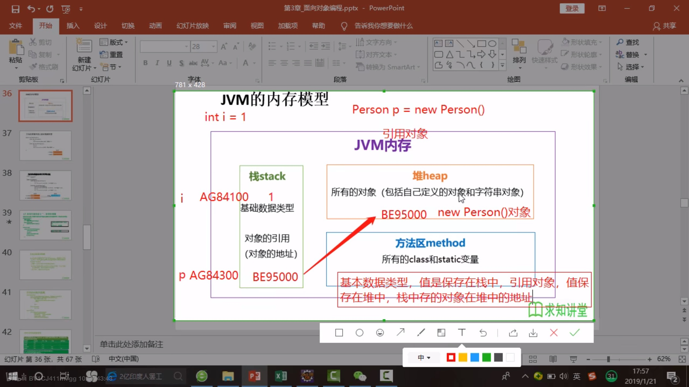
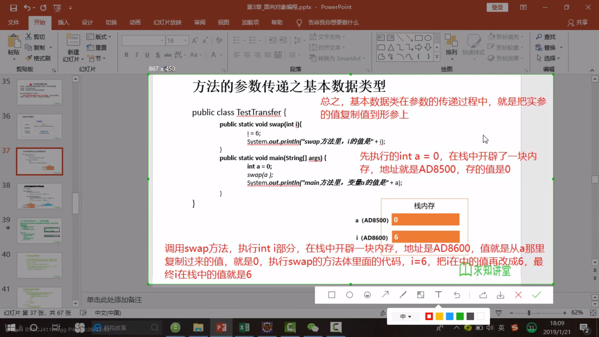
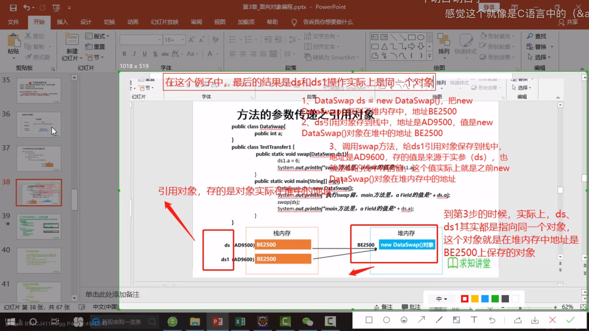
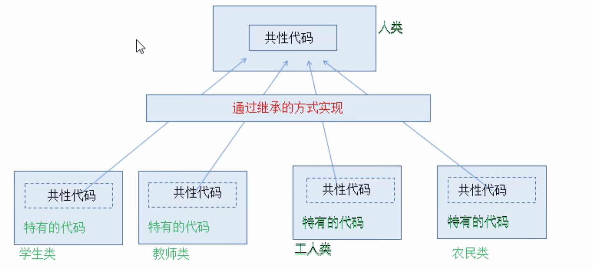
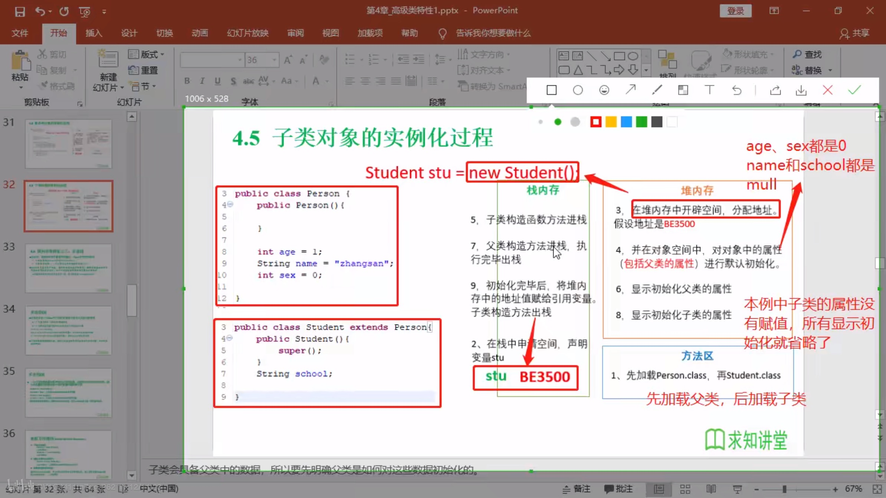

# day_1

## 1-1 常用dos命令

+ **dir**:列出当前目录下的文件及文件夹
+ **md**:创建目录
+ **rd**:删除目录
+ **cd**:进入指定目录
+ **cd**..:返回上一级目录
+ **cd\\**:返回根目录
+ **del**:删除文件
+ **exit**:退出

## 1-2 Java 两种核心机制

Java程序并非是直接运行的，Java编译器将**Java源程序编译成与平台无关的字节码文件(class文件)**，然后由**Java虚拟机（JVM）对字节码文件解释执行**。所以在不同的操作系统下，只需安装不同的Java虚拟机即可实现java程序的跨平台。

+ Java虚拟机，`JVM（Java Virtual Machine）`
+ 垃圾回收机制，`GC`

语言特点：

+ 跨平台性

## 1-3 JDK,JRE,JVM

+ `JDK`是包含了java开发的工具包。
+ `JRE`Java Runtime Environment），Java运行环境，包含了JVM和Java的核心类库（Java API）
+ JDK包含JRE包含`JVM`

## 1-4 计算机存储单元

我们知道计算机是可以用来存储数据的，但是无论是内存还是硬盘，计算机存储设备的最小信息单元叫“**位（bit）**”，我们又称之为“比特位”，通常用小写的字母”b”表示。而计算机中**最基本的存储单元叫“字节（byte）”**，通常用大写字母”B”表示，**字节是由连续的8个位组成。**
除了字节外还有一些常用的存储单位，其换算单位如下：
**1B（字节） = 8bit**
1KB = 1024B
1MB = 1024KB
1GB = 1024MB
1TB = 1024GB

# day_2

+ 关键字:专门用途，勿作他用

+ 保留字:可能在java以后版本作为关键字使用的单词

## 2-1 数据类型

+ 基本数据类型

  + 数值型
    - [x] 整数类型:`int`（4字节）,`short`（2字节）,`long`（8字节）,`byte`（1字节=8bit）
    - [x] 浮点数类型:`float`,`double`

  + 字符型:`char`
  + 布尔型:`boolen`

+ 引用数据类型(可以在初始化的时候赋值为`null`)

  + 类:`class`(`string` 在里面)

    + `String`:不可变类，创建的对象不可更改。

      ```java
      String s0 = "hello";
      String s1 = "hello";
      String s2 = "he" + "ll" + "o";
      //内存中只有一个"hello"
      ```

  + 接口:`interface`

  + 数组:[]

+ `long`类型赋值时需+L: 

  ```java
  long l  = 3L;
  ```

+ 定义浮点型时默认为`double`,而需定义`float`类型时需+f\F:

  ```java
  float f = 3.0f;
  ```

+ 基本数据类型转换

  + 自动转换:`char`,`byte`,`short`--->`int`--->`long`--->`float`--->`double`。
  + `char`,`byte`,`short`不会相互转换，都转换为**int**类型再计算。
+ 有多种数据混合运算时，系统先转换为**容量较大**的类型。
  + 多个相同类型变量计算时，系统先转换为对应的**默认类型**。
+ **boolean**类型不能与其他基本数据类型相互转换。

## 2-2 标识符（记忆、理解）

标识符是用户编程时使用的名字，用于给类、方法、变量、常量等命名。
Java中标识符的组成规则：
由**字母、数字、下划线“_”、美元符号“$”**组成，第一个字符不能是数字。
不能使用java中的关键字作为标识符。
标识符对大小写敏感（**区分大小写**）。
Java中标识符的命名约定：
**小驼峰式**命名：变量名、方法名；
首字母小写，从第二个单词开始每个单词的首字母大写。
**大驼峰式**命名：类名；
每个单词的首字母都大写。

# day_3

## 3-1 数据输入（应用）

我们可以通过 Scanner 类来获取用户的输入。使用步骤如下：
1、导包。Scanner 类在java.util包下，所以需要将该类导入。导包的语句需要定义在类的上面。

```JAVA
import java.util.scanner;
```

2、创建Scanner对象。

```java
Scanner sc = new Scanner(System.in);
```

3、接收数据

```
int i = sc.nextInt();
```

## 3-2 Random产生随机数（掌握）

**概述**：
`Random`类似`Scanner`，也是Java提供好的API，内部提供了产生随机数的功能
API后续课程详细讲解，现在可以简单理解为Java已经写好的代码
使用步骤：

1. 导入包

  ```java
  import java.util.Random;
  ```

2. 创建对象

  ```java
  Random r = new Random();
  ```

3. 产生随机数

  ```java
  int num = r.nextInt(10);
  ```

  解释： 10代表的是一个范围，如果括号写10，产生的随机数就是0-9，括号写20，参数的随机数则是0-19。

## 3-3 String类

### 3-3-1 String类概述【理解】

String 类代表字符串，Java 程序中的所有字符串文字（例如“abc”）都被实现为此类的实例。

也就是说，Java 程序中所有的双引号字符串，都是 String 类的对象。String 类在 **java.lang** 包下，所以使用的时候不需要导包！

### 3-3-2 String类的特点【理解】

+ 字符串不可变，它们的值在创建后不能被更改。
+ 虽然 String 的值是不可变的，但是它们可以被共享。
+ 字符串效果上相当于字符数组( char[] )，但是底层原理是字节数组( byte[] )。

### 3-3-3 创建字符串对象两种方式的区别【理解】

+ **通过构造**方法创建：
  通过 new 创建的字符串对象，每一次 new 都会申请一个内存空间，虽然内容相同，但是**地址值不同**。
+ **直接赋值**方式创建：
  以*“abc”*方式给出的字符串，只要字符序列相同(顺序和大小写)，无论在程序代码中出现几次，JVM 都**只会建立一个 String 对象**，并在**字符串常量池**中维护。

```java
//三种创建方式
String s1 = new String();
char[] arr = {'a', 'v', 'c'};
String s2 = new String(arr);
byte[] brr = {97, 98, 99};
String s3 = new String(brr);
```


### 3-3-4 String类的方法

+ `public boolean equals(Object object)` 比较字符串的内容，严格区分大小写(用户名和密码)。字符串比较使用`equals()`方法。
+ `public char charAt(int index)` 返回指定索引处的 char 值
+ `public int length()` 返回此字符串的长度
+ `public String substring(int index)`**截取**从参数位置到字符串末尾，返回新字符串，原字符串不变
+ `public String substring(int begin, int end)`截取从begin开始到end结束的字符串，并返回一个新的字符串，原字符串不变     注意：**[begin, end)**包含左边不包含右边。
+ `public char[] toCharArray()`将当前字符串拆分成**字符数组**作为返回值
+ `public byte[] getBytes()`获得当前字符串底层的字节数组
+ `pubic String replace(CharSequence target, CharSequence replacement)`将字符串的部分字符串替换成新的字符串并返回改变后的字符串，原字符串不变
+ `public String[] split(String regex)`按regex规则将字符串切分成若干部分
+ `public String[] split(String regex, int limit)`按regex规则将字符串切分成limit个部分

## 3-4 StringBuilder类

StringBuilder 是一个可变的字符串类，我们可以把它看成是一个容器，这里的可变指的是 StringBuilder 对象中的内容是**可变**的。而String类的内容是**不可变**的。

<u>？？？</u>

### 3-4-1 StringBuilder的方法

+ `public StringBuilder()` ：创建一个空白可变字符串对象，不含有任何内容。
+ `public StringBuilder(String str)` ：根据字符串的内容，来创建可变字符串对象。
+ `public StringBuilder append(任意类型)`： 添加数据，并返回对象本身。
+ `public StringBuilder reverse()` ：返回相反的字符序列。

### 3-4-2 StringBuilder和String的转换

+ StringBuilder转换为String：
  `public String toString()`：通过 toString() 就可以实现把 StringBuilder 转换为 String。
+ String转换为StringBuilder：
  `public StringBuilder(String s)`：通过构造方法就可以实现把 String 转换为 StringBuilder。

# day_4

## 4-1 一维数组初始化

+ **动态初始化**:先声明，后赋值

  ```java
  int[] arr = new int[4];
  arr[0] = 1;
  arr[1] = 2;
  ```

+ 静态初始化:声明时变赋值

  ```java
  int[] arr = new int[]{1, 2, 3};
  int[] arr = {1,2,3};
  ```

+ 每个数组都有一个属性:straight_ruler:length

+ 默认初始化

  ```java
  int[] arr = new int[4];
  //默认值都为0
  ```

## 4-2 二维数组

+ 初始化

  ```java
  int[][] arr1 = new int[][]{
      {1,2}, 
      {3,5}
  };
  
  int[][] arr2 = new int[2][3];
  
  int[][] arr3 = new int[2][];//二维不定义
  
  int[] arr4[] = new int[1][2];
  ```

+ 遍历二维数组

  ```java
  for (int i = 0; i < arr.length; i++) {        
      for (int j = 0; j < arr[i].length; j++) { 
          System.out.println(arr[i][j]);        
      }                                              
  }                                                  
  ```


## 4-3 内存分配

### 4-3-1 内存概述

内存是计算机中的重要原件，临时存储区域，作用是运行程序。我们编写的程序是存放在硬盘中的，在硬盘中的程序是不会运行的。**必须放进内存中才能运行**，运行完毕后会清空内存。**Java虚拟机要运行程序，必须要对内存进行空间的分配和管理。**

### 4-3-2 java中的内存分配

目前我们只需要记住两个内存，分别是：**栈内存和堆内存**.

| 区域名称   | 作用                                                       |
| ---------- | ---------------------------------------------------------- |
| 寄存器     | 给CPU使用，和我们开发**无关**。                            |
| 本地方法栈 | JVM在使用操作系统功能的时候使用，和我们开发**无关**。      |
| 方法区     | 存储可以运行的class文件。                                  |
| 堆内存     | 存储对象或者数组，new来创建的，都存储在堆内存。            |
| 方法栈     | 方法运行时使用的内存，比如main方法运行，进入方法栈中执行。 |

**总结**：每个方法在被调用执行的时候，都会进入栈内存，并且拥有自己独立的内存空间，方法内部代码调用完毕之后，会从栈内存中弹栈消失。

# day_5

## 5-1 面向对象

+ **三大特性**：
  + *封装*
  + *继承*
  + *多态*

## 5-2 class类

> 类是对象的数据类型，类是具有相同属性和行为的一组对象的集合。
>
> 类：类是对现实生活中一类具有共同属性和行为的事物的抽象。
> 对象：是能够看得到摸的着的真实存在的实体。
> 简单理解：**类是对事物的一种描述，对象则为具体存在的事物。**

+ 属性：指事物的特征，例如：手机事物（品牌，价格，尺寸）
  行
+ 方法：指事物能执行的操作，例如：手机事物（打电话，发短信）

```java
public class Person {
    //属性,成员变量，类的成员变量可以先声明，不用初始化，且有默认值
    private String name;//姓名，String默认值位null
    private int age;//年龄，int的默认值位0
    
    //方法
    /*
    * 打印姓名*/
    public void showName() {
        System.out.println(name);
    }
    /*
    *获取年龄
    */
    public int getAge() {
        return age;
    }
}
```

### 5-2-1 实例化类（创建对象）

```java
Person p = new Person();//声明一个Person类型变量
/*
可以给属性赋值，并调用方法
*/
```

###  5-2-2 属性

+ 语法格式:

  ```
  //修饰符 类型 属性名 (= 初值);
  ```

  + 修饰符
    + `private`: 该属性只能由类内部访问
    + `public`:内外均可访问
    + `default`:类内部，包内部访问
    + `protected`:类内部，包内部，子类可以访问
  + 类型：基本数据类型

+ 变量

  + 成员变量

    + 实例变量：只有将类实例化成对象之后才能使用

      ```java
      private String name;//姓名，String默认值位null
      private int age;//年龄，int的默认值位0
      ```

    + 类变量：static修饰，不需要类实例化成对象就可使用，直接通过类名调用

      ```java
      public static String gender = "male";
      ```

  + 局部变量

### 5-2-3 方法

+ 语法格式

  ```
  //修饰符 返回值类型 方法名 (参数s) {
  	方法体;
  }
  ```

  + 修饰符
    + `public`
    + `private`
    + `protected`
    + `default`
  + 返回值类型:return；void

> 注：方法中不能再定义方法（禁止套娃）

## 5-3 关于对象

### 5-3-1 匿名对象

+ 不定义对象的句柄，直接调用这个对象的方法

```java
new Person().shout();
```

+ 使用情况
  + 适用于只调用一次方法
    + 将匿名对象作为实参传递给一个方法调用

> 提示：
>
> 1.在一个类中，类的方法可以直接访问类中的成员变量。（例外，static方法中访问非static，编译不通过）
>
> 2.在不同类中，要先创建要访问的类的对象，再用对象访问类中定义的成员。

### 5-3-2 多个对象指向相同内存

当多个对象的引用指向同一个内存空间（变量所记录的地址值是一样的），
只要有任何一个对象修改了内存中的数据，随后，无论使用哪一个对象进行数据获取，都是修改后的数据。

## 5-4 方法重载

+ 概念：在一个类中，出现同名方法，方法中的参数个数或类型不同。
+ 特点：与返回值类型无关，只看***参数列表***，且参数列表***必须不同***。

```java
public int add(int x, int y) {
    return x + y;
}
//参数个数不同    
public int add(int x, int y, int z) {
    return x + y + z;
}
```

```java
public int add(int x, int y) {
    return x + y;
}
//参数类型不同    
public int add(int x, double y) {
    return x + y
}
```

```java
public double add(double x, int y) {
    return x + y;
}
//顺序不同     
public double add(int y, double x) {
    return x + y
}
```

## 5-5 成员变量和局部变量

+ 类中位置不同：成员变量（**类中方法外**）||  局部变量（**方法内部或方法声明上**）。
+ 内存中位置不同：成员变量（**堆内存**）||  局部变量（**栈内存**）。
+ 生命周期不同：成员变量（随着对象的存在而存在，随着对象的消失而消失）||  局部变量（随着方法的调用而存在，随着方法的调用完毕而消失）。
+ 初始化值不同：成员变量（有默认初始化值）||  局部变量（没有默认初始化值，必须先定义，赋值才能使用）。

# day_6

## 6-1 可变参数

JDK1.5后出现的新特性，在定义方法时使用。

底层由数组实现，传递参数个数任意。

```java
//用数组方式
//如果没有参数，调用时就要定义一个空数组或者null
public void printInfo(String[] args) {
    for(int i = 0;i < args.length;i++) {
        System.out.println(args[i]);
    }
}
//用java特有的...方式，与String[] args相同用法
//如果没有参数，调用时可以不填
//方法有多个形参，可变形参(...)放在所有参数之后
public void printInfo1(int x, String... args) (对)
public void printInfo1(String... args, int x) (错)
public void printInfo1(String... args) {
    for(int i = 0;i < args.length;i++) {
        System.out.println(args[i]);
    }
}
```

> **使用方法与数组一样**。

## 6-2 方法参数传递

+ 形参
+ 实参

### 6-2-1 JVM内存模型



#### 6-2-1-1 基本数据类型



#### 6-2-1-2 引用对象 



### 6-2-5 总结

+ 方法的参数传递
  + 如果方法的形参是**基本数据类型**，那么实参（实际的数据）向形参传递参数时，就是把实参的值**复制**给形参。**每个方法在栈内存中，都会有独立的栈空间，方法运行结束后就会弹栈消失。**
  + 如果方法的形参是**对象（引用数据类型）**，那么实参（实际的对象）向实参传递参数时，就是把实参在**栈中的值---引用对象在堆中的地址**传递给形参。引用数据类型的传参，传入的是地址值，内存中会造成两个引用指向同一个内存的效果，所以即使方法
    弹栈，堆内存中的数据也已经是改变后的结果
+ 基本数据类型都保存在栈中，引用对象在栈内存中保存的是引用对象在堆中的地址，方法传递的参数就是传递值（***变量在栈中的值***）。

## 6-3 封装和隐藏

Java中将数据声明私有化(private)，提供公共(public)方法：get，set对该属性进行操作。

目的：

+ 隐藏类中不需要对外界提供的实现细节
+ 方便加入控制逻辑，限制不合理操作

```java
    private String name;
    private int age;

    public String getName() {
        return name;
    }

    public void setName(String name) {
        this.name = name;
    }

    public int getAge() {
        return age;
    }

    public void setAge(int age) {
        if(age >= 150 || age <=0) {
            System.out.println("不合理");
        } else 
            this.age = age;
    }
```

### 6-3-1 权限修饰符

| 修饰符        | 类内部 | 同一个包 | 子类 | 除上述任何地方 |
| ------------- | ------ | -------- | ---- | -------------- |
| private       | yes    |          |      |                |
| default(缺省) | yes    | yes      |      |                |
| proteced      | yes    | yes      | yes  |                |
| public        | yes    | yes      | yes  | yes            |

> 访问权限

+ 在一个java文件中，只能有一个class由public修饰，其余class只能`缺省(default)`,且default修饰的只能再同一个***包***中使用。

### 6-3-2 封装思想【理解】

1. 封装概述 是面向对象三大特征之一（封装，继承，多态） 是面向对象编程语言对客观世界的模拟，客观世界里成员变量都是隐藏在对象内部的，外界是无法直接操作的。
2. 封装原则 将类的某些信息隐藏在类内部，不允许外部程序直接访问，而是通过该类提供的方法来实现对隐藏信息的操作和访问 成员变量private，提供对应的getXxx()/setXxx()方法。
3. 封装好处 通过方法来控制成员变量的操作，提高了代码的安全性 把代码用方法进行封装，提高了代码的复用性。

## 6-4 类的构造方法

```java
public class Person4 {
    private int age;
    private String name;
//构造方法重载
    public Person4(int age, String name) {
        this.age = age;
        this.name = name;
    }

    public Person4(String name) {
        this.name = name;
    }

    public Person4(int age) {
        this.age = age;
    }
//默认构造器，默认构造器的修饰符与所属类的修饰符相同
    public Person4() {
    }
}
```

> **父类构造器不可被子类继承**。

## 6-5 this关键字

+ this表示当前对象，访问本类内容，可以调用类的属性、方法和构造器。
+ 方法的形参如果与成员变量**同名**，不带this修饰的变量指的是形参，而不是成员变量。
+ 方法的形参没有与成员变量同名，不带this修饰的变量指的是成员变量。
+ 使用情况
  + 在方法内部使用，即这个方法所属对象。
  + 在构造器内部使用，表示构造器正在初始化的对象。

在构造方法中使用this关键字的**特殊情况**：

+ this()的调用必须是构造方法中的第一个语句，也是唯一一个。
+ super和this两种构造调用是不能同时使用的。

## 6-6 super关键字

作用：

+ 在子类的成员方法中，访问父类的成员变量。
+ 在子类的成员方法中，访问父类的成员方法。
+ 在子类的构造方法中，访问父类的构造方法。

# day_7

## 7-1 继承

> 把共性抽取形成父类。
>
> 关键字“extends”，*子类不是父类的子集，而是**父类的扩展**。*
>
> 子类不能访问父类的private修饰的变量。但可通过**get、set**方法访问。



+ Java<u>只能单继承，不能多重继承。</u>
+ 一个子类只能有一个父类，而一个父类可以有多个子类。

### 7-1-1 继承的好处和弊端

+ 继承好处
  + 提高了代码的复用性(多个类相同的成员可以放到同一个类中)。
  + 提高了代码的维护性(如果方法的代码需要修改，修改一处即可)。

+ 继承弊端
  + 继承让类与类之间产生了关系，类的耦合性增强了，当父类发生变化时子类实现也不得不跟着变化，削弱了子类的独立性。

### 7-1-2 方法重写(override)

+ 重写方法与被重写方法<u>具有相同的方法名称、参数列表和返回值类型</u>。
+ 重写方法<u>不能使用比被重写方法更严格的访问权限</u>。
+ 重写方法与被重写方法需<u>同时为static或同为非static</u>。

+ <u>子类方法抛出的异常不能大于父类被重写方法的异常</u>。

### 7-1-3 super关键字

+ super可以访问父类定义的属性、成员方法
+ super可用于子类构造方法中调用父类的构造器
+ super代表父类内存空间的标识
+ supe可以调用子类之上的**所有**父类层级

**调用父类构造器**

+ 所有子类构造器会**默认**访问父类中**空参数**的构造器
+ 在父类***只有*****有参构造的时候**，子类**必须**显式的构造一个**调用父类的有参构造**，并且调用父类方法要写在第一行。

```java
public Class Person{
    public Person(String name) {//带参构造方法

   }
}

public class P extends Person{//子类必须显式的构造一个调用父类的有参构造
    public P(String name) {
        super(name);
    }
}
```

## 7-2 this与super的区别

| 序号 | 区别点     | this                                   | super                        |
| ---- | ---------- | -------------------------------------- | ---------------------------- |
| 1.   | 访问属性   | 访问本类属性，如果本类没有，则访问父类 | 只访问父类属性               |
| 2.   | 调用方法   | 访问本类方法，如果本类没有，则访问父类 | 只访问父类方法               |
| 3.   | 调用构造器 | 调用本类构造器，必须放在首行           | 调用父类构造器，必须放在首行 |
| 4.   | 特殊情况   | 表示***当前对象***                     | 无                           |





## 7-3 多态

**概念**：同一个对象，在不同时刻表现出来的不同形态。同一行为，具有多个不同表现形式。

多态的**前提**：

+ 要有继承或实现关系；
+ 要有方法的重写；
+ 要有父类引用指向子类对象。

**格式**：

+ 父类名称 对象名 = new 子类名称();
+ 接口名称 对象名 = new 实现类名称();

**体现**：

+ 方法重载：本类的同名方法，体现相同的名称方法实现不同的逻辑；
+ 方法重写：子类对父类方法的覆盖，子类可以使用和父类相同的方法名，覆盖父类的逻辑；父类的方法，***想修改逻辑，但有别的代码在调用父类方法，这时考虑子类继承父类，如何重写父类方法。***

+ 对象的多态性---子类对象可以代替父类对象使用

  + 一个变量只能有一种确定的数据类型
  + 一个引用类型变量可能指向多个不同类型对象

  ```java
  Person p = new Person();
  Person e = new Student();//引用类型变量e指向Student类型对象
  ```

  > 向上转型：
  >
  > *子类可以看作是特殊的父类*，所以父类类型的引用可以指向子类对象：**向上转型**。
  >
  > **向上转型一定是安全的。**从小范围变成大范围。但子类特有方法将无法调用。
  >
  > 向下转型：
  >
  > 格式：子类名称 对象名 = (子类名称)父类对象;  将父类对象还原成原来的子类对象。
  >
  > **必须原路返回，否则运行时会报错。**
  >
  > ```java
  > Fu f = new Zi();//向上转型
  > Zi zi = (Zi)f;//向下转型
  > zi.method();
  > ```
  >
  > 

成员访问特点：

+ 成员变量
  + 编译看父类，运行看父类
+ 成员方法·
  + 编译看父类，运行看子类

Java引用变量有两个类型：

+ **编译**时类型：由声明该变量时使用的类·                      型决定
+ **运行**时类型：由实际赋给该变量的对象决定

> *若编译时类型和运行时类型不一致，就出现**多态**。*

- [ ] 一个引用类型变量如果声明时为父类类型，但实际引用的是子类对象，那该变量就不能访问子类中*添加的属性*。

  ```java
  Student m = new Student();
  m.school = "SHU";
  
  Person e = new Student();
  e.school = "DHU";//非法
  //属性是编译时确定的，编译时e为Person类型，没有school成员变量，因而编译错误。
  ```

### 7-3-1 虚拟方法调用

```java
public class TestDemo {
    public static void main(String[] args) {
        Person p = new Person();
        p.showInfo();

        Student s = new Student();
        s.showInfo();

        Person e = new Student();
        e.showInfo();//输出Student()的showInfo()方法
    }
}
```

> 编译时e为Person类型，而方法调用是运行时确定，所以调用Student()的showInfo()方法。---**动态绑定**

- [x] ***编译看左边，运行看右边。***

### 7-3-2 多态小结

+ 前提：
  + 需要存在继承或实现关系
  + 要有覆盖操作

+ 成员方法
  + 编译时：要查看引用变量所属类是否有所调用的方法
  + 运行时：调用实际对象的成员方法
+ 成员变量：
  + 不具备多态性，只看引用变量所属的类

## 7-4 instanceof

 作用：检验x是否为类A的子类，返回值为boolean型。

```java
Person p = new Person();

Student s = new Student();

Person e = new Student();

System.out.println(p instanceof Person);//true
System.out.println(s instanceof Student);//true
System.out.println(e instanceof Student);//true
```

## 7-5 Object类

+ 所以Java类的根父类（基类）

+ 类的声明默认extends Object类

  ```java
  void method(Object obj) {...}//可以接受任何类做为参数	
  ```

  ```java
  p.equals(e);//比较引用对象是否为同一个（地址是否相同）
  p.hashCode();//取得hash码
  p.toString();//取得内存地址
  ```


# day_8

## 8-1 对象类型转换

+ 基本数据类型转换

  + 自动类型转换：范围小的数据类型转换为大的数据类型

    ```java
    int i = 1;
    long l = i;//合法
    ```

  + 强制类型转换：范围大的数据类型转换为小的数据类型

    ```java
    long l = 1L;
    int i = l;//非法
    int i = (int) l;//合法
    ```

+ 对象的类型转换

  + *<u>子类到父类可以直接转换</u>*

    ```java
    Person p = new Person();
    Student s = new Student();
    
    p = s;//合法
    ```

  + *<u>父类到子类需要强制转换</u>*

    ```java
    Person p = new Person();
    Student s = new Student();
    
    s = (Student) p;//需强转
    ```

  + *<u>**无继承关系的转换非法**</u>*

## 8-2 == & equals()

+ **== **<u>*比较对象时*</u>只有指向同一对象时才为true  

+ **equals()** 只能比较引用类型，比较的是是否为同一地址，与==相同

> **特例**：当用equals()方法比较时，对类`File,String,Date,包装类(Wrapper Class)`是比较类型及**内容**时**<u>*不考虑引用的是否为同一对象*</u>**。

+ 如果不想用某一个类的equals()方法比较对象的内存地址，就需要**重写**equals()方法。


### 8-2-1 重写equals()方法

```java
@Override
    public boolean equals(Object obj) {
        if(obj instanceof MyDate) {//判断传入的obj是否为子类
            MyDate m = (MyDate) obj;//如果是，就强制转换
            if(this.month == m.month && this.year == m.year && 	this.day == m.day) {//比较值是否相等
                return true;
            }
        }
        return false;
    }
```

## 8-3 static关键字

> 类属性、类方法：设计类时，不想使属性、方法随对象不同而改变。

### 8-3-1 类变量

+ 局部变量不能被声明为 static 变量。

```java
public class Chinese {
    static String country;//类变量（静态变量），不用实例化，直接类名.属性就可以使用，是类的一部分，被所有这个类的实例化对象共享
    String name;
    int age;//实例变量，只有实例化之后才能使用，属于实例化对象的一部分，不可共享
    
	public static void main(String[] args) {
        Chinese c = new Chinese();
        Chinese.country = "China";//类名.属性调用
    }
}

```

### 8-3-2 类方法

+ 类名.方法名调用；
+ 做工具类；
+ **方法内不能用this()和super()；**
+ **静态方法不能使用类的非静态变量。**

## 8-4 单例设计模式

+ 避免多次重复实例化对象

```java
/*单例设计模式--饿汉式--只new一次对象*/
public class Single {
    //私有构造，构造方法私有化，调用类时不能直接使用new来创建对象
    private Single() {
        
    }
    //私有的Single类型类变量,只创建一次
    private static Single single = new Single();
    
    public static Single getInstance() {
        return single;
    }
}
```

```java
//调用
public class Test {
    public static void main(String[] args) {
        Single s = Single.getInstance();//类方法，类名.方法
    }
}
```

```java
/*单例设计模式--懒汉式*/
public class Single1 {
    //私有化构造，外界不能直接new对象
    private Single1() {
        
    }
    
    private static Single1 s1 = null;
    //如果实例未创建，就先创建，在返回给调用者
    public static Single1 getInstance() {
        if(s1 == null) {
            s1 = new Single1();
        }
 		
        return s1;
    }
}
```

# day_9

## 9-1 代码块

```java
public class Person {
    private String name;

    public Person() {
        this.name = "jj";
        System.out.println("执行构造方法");
    }
    //非静态代码块
    {//静态\非静态修饰的属性和方法均可执行
        System.out.println("执行非静态代码块");
    }
    //静态代码块
    static {
        //只能使用静态(static)修饰的属性和方法
        System.out.println(age);
    }
}
```

在new Person()的时候执行步骤：

+ 1.类的属性的默认初始化和显示初始化
+ 2.执行代码块的代码
+ 3.执行构造器的代码

> 每次new Person()时：
>
> 非静态代码块重新执行，而静态代码块**只能执行一次**。
>
> 静态代码块执行**<u>*先于*</u>**非静态代码块。

## 9-2 final关键字

+ final修饰的**类**<u>不能继承</u>；

+ final修饰的**方法**<u>不能被子类重写</u>；

+ final修饰的变量为**常量**，名称全部大写；

+ fianl修饰基本数据类型变量，不能再次赋值；

+ final 修饰指的是引用类型的**地址值不能发生改变**，但是地址里面的**内容是可以发生改变的**；

+ final static一起修饰就是**全局常量**。

  ```java
  final static int A = 1;
  ```


## 9-3 抽象类

父类设计的非常抽象，以至于没有具体实例。如果父类中的方法不确定如何进行{}方法体的实现，那么这就应为一个**抽象方法**。

+ 用abstract关键字修饰类，就是抽象类。

+ 用abstract关键字修饰方法，就是抽象方法。

  + 抽象方法只有声明，没有方法的实现。

+ **含有抽象方法的类必须声明为抽象类**，但抽象类中不一定含有抽象方法。

+ **抽象类不能被实例化。**抽象类是用来当作父类被继承的，抽象类的子类必须**覆盖重写**父类的抽象方法，并提供方法体。**若没有重写全部抽象方法，仍为抽象类。**

+ 不能用abstract修饰属性，私有方法，构造器，静态方法，final修饰的方法(**抽象类必须被继承才能实现**)。

+ 抽象类中，可以有构造方法，是供子类创建对象时，初始化父类成员使用。

  > 理解：子类的构造方法中，有默认的super();，会访问父类的构造方法。

  ```java
  public abstract Animal{
  	public Aniaml(){
          //方法体
      }
      
      public abstract void move();//抽象方法
  }
  
  public Cat extends Aniaml{
      public Cat() {
          //super();默认存在，写不写都一样
          System.out.println("Cat");
      }
      
      @Override
      public void move() {
  		//方法体
      }
  }
  ```

  **实现:**

```java
public abstract class Animal {
    public abstract void test();
    
    public abstract void move();//抽象类，没有方法体
}
```

```java
public abstract class Bird extends Animal {//抽象类也能继承抽象类
    @Override
    public void move() {
        
    }
    
    public abstract void test();//只要有一个抽象方法没有被实现，类必须为抽象类
}
```

```java
public class Dog extends Animal {//必须重写抽象类中所有的抽象方法
    @Override
    public void test() {

    }

    @Override
    public void move() {

    }

}
```

## 9-4 模板方法设计模式


```java
public abstract class Template {//定义抽象类
    public abstract void code();//定义抽象方法

    public final void getTime() {//得到code()方法执行的时间的方法
        long start = System.currentTimeMillis();
        code();
        long end = System.currentTimeMillis();
        System.out.println("code方法执行的时间为：" + (end - start));
    }
}
```

```java
public class TemplateTest extends Template{
    public void code() {
        for (int i = 0; i < 10000;i++) {
            System.out.print(i + " ");
        }
        System.out.println();
    }

    public static void main(String[] args) {
        TemplateTest templateTest = new TemplateTest();
        templateTest.getTime();
    }
}
```

## 9-5 接口

接口就是一种**公共的规范标准**。

**一定要明确它并不是类，而是另外一种引用数据类型。**

> 引用数据类型：数组、类、接口。

+ 有时必须从几个类中派生出一个子类，继承它们的所有属性和方法。但是，Java不支持多重继承，有了接口，就可以起到多重继承的效果。
+ 接口是抽象方法和常量值的定义的集合。
+ 本质上，**接口是一种特殊的抽象类**，这种抽象类只包含常量和方法的定义，但没有变量和方法的实现。
+ 一个类可以实现多个接口，接口也可以继承其他接口。

> 如果实现接口的类没有实现接口这的全部方法， 那么必须将此类定义为抽象类。

**特点**：

+ 所有成员**变量**默认`public static final`修饰，**且必须有初始值**，常量名称使用大写字母。
+ 所有成员**方法**默认`public abstract`修饰。
+ 接口没有构造器。

**定义接口**

```java
public interface TestInterface01 {
    void work();
}
public interface TestInterface02 {
    void work02();
}
```

**实现接口**

使用`implements`关键字，

接口的实现类必须覆盖重写接口中所有的抽象方法。

```java
//类可以同时实现多个接口
public class InterfaceImplement implements TestInterface01,TestInterface02{
    @Override
    public void work01() {

    }

    @Override
    public void work02() {

    }
}
```

```java
//接口可以继承接口，且可以继承多个
public interface TestInterface03 extends TestInterface01, TestInterface02{
    
}
```

**接口中的默认方法**

Java8开始，允许在接口中添加默认方法。

默认方法是为了**解决接口升级的问题**：当接口增加新的默认方法时，原来实现了它的类却不需要在覆盖重写新的方法。实现它的类可以**直接调用**新添加的默认方法（*如果没有被覆盖重写*）。

```java
public interface MyInterface {
    //抽象方法，不含方法体
	void test();
    //默认方法，含方法体
    [public] default void test02() {
		//方法体
    }
}

public class MyInterfaceImpl implements MyInterface{
    @Override
    public void test() {
        System.out.println("test");
    }
    //不重写test02()方法也不会报错
}
```

**接口中的静态方法**

不能通过接口实现类对象来调用接口中的静态方法。

```java
public interface MyInterfaceStatic {
    [public]  static void test() {
        System.out.println("接口静态方法!");
    }
}

//使用接口静态方法
public static void main(String[] args) {
     MyInterfaceStatic.test();//接口名.方法名();
}
```

**既有继承又有实现🕉**

实现多个接口时：

+ 接口中有多个抽象方法时，实现类必须重写所有抽象方法。如果抽象方法重名的，则**只须重写一次**。
+ 接口中有多个默认方法时，实现类都可以继承使用。如果默认方法重名的，则必须重写一次。

```java
//先继承后实现
class InterfaceImplement extends Person implements TestInterface01,TestInterface02{
    @Override
    public void work01() {

    }

    @Override
    public void work02() {

    }
}
```

**总结**：

+ 抽象类是对于一类事物的高度抽象，其中既有属性也有方法。
+ 接口是对方法的抽象，也就是对一系列动作的抽象。
+ 当需要对一类**事物抽象**的时候，应该使用**抽象类**，便于形成一个**父类**。
+ 当需要对一系列**动作抽象**时，就使用**接口**，需要使用这些动作的类去**实现对应的接口**即可。
+ 接口中，无法定义成员变量，但是可以定义常量，其值不可以改变，默认使用*public static final*修饰。
+ 接口中，没有构造方法，不能创建对象。
+ 接口中，没有静态代码块。

## 9-6 内部类

概念：在一个类中定义一个类。举例：在一个类A的内部定义一个类B，类B就被称为内部类。

**内部类的访问特点**：

+ 内部类可以直接访问外部类的成员，包括私有
+ 外部类要访问内部类的成员，必须创建对象

```java
public class Test3 {
    int i,j,k;

    class A{
        int i = 4;
        public void setTest3() {
            Test3.this.i = 1;//内部类访问外部类
            Test3.this.j = 2;
            Test3.this.k = 3;
        }
    }

    public void setInfo() {
        new A().setTest3();//外部类访问内部类
        new A().i = 5;
    }

    public void showInfo() {
        System.out.println(this.i);
        System.out.println(this.j);
        System.out.println(this.k);
    }

    public static void main(String[] args) {
        Test3 test3 = new Test3();
        test3.setInfo();
        test3.showInfo();
    }
}
```

### 9-6-1 成员内部类

成员内部类的定义位置：

+ 在类中方法，跟成员变量是一个位置

外界创建成员内部类格式：

+ 格式：外部类名.内部类名 对象名 = 外部类对象.内部类对象;
+ 举例：Outer.Inner oi = new Outer().new Inner();

成员内部类的**推荐使用方案**：

+ 将一个类，设计为内部类的目的，大多数都是不想让外界去访问，所以内部类的定义应该私有化，私有化之后，再提供一个可以让外界调用的方法，方法内部创建内部类对象并调用。

```java
package Test.Inner;

/**
 * @author jx
 * @date 2021/8/16
 **/
public class Outer {
    private int a = 1;
    private class Inner{//私有化内部类
        public void show() {
            System.out.println(a);
        }
    }

    public void method() {//创建方法调用内部类
        Inner inner = new Inner();
        inner.show();
    }
}

```

```java
package Test.Inner;

/**
 * @author jx
 * @date 2021/8/16
 **/
public class InnerDemo {
    public static void main(String[] args) {
//        Outer.Inner inner = new Outer().new Inner();
        //内部类为public修饰时的调用方法
//        inner.show();
        Outer outer = new Outer();
        outer.method();
    }
}
```

### 9-6-2 局部内部类

局部内部类定义位置：

+ 局部内部类是在**方法中定义的类**

局部内部类方式方式：

+ 局部内部类，外界是无法直接使用，需要在方法内部创建对象并使用
+ 该类可以直接访问外部类的成员，也可以访问方法内的局部变量

```java
package Test.LocalInner;

/**
 * @author jx
 * @date 2021/8/16
 **/
public class LocalInner {
    private int n1 = 1;

    public void method() {
        int n2 = 2;
        class Inner{//局部内部类，在方法中定义
            public void show() {
                System.out.println(n1);
                System.out.println(n2);
            }
        }

        Inner inner = new Inner();
        inner.show();
    }

    public static void main(String[] args) {
        LocalInner li = new LocalInner();
        li.method();
    }
}
```

### 9-6-3 匿名内部类

匿名内部类的前提：

+ 存在一个类或者接口，这里的类可以是具体类也可以是抽象类

匿名内部类的格式：

+ 格式：new 类名 ( ) { 重写方法 } new 接口名 ( ) { 重写方法 }

匿名内部类的本质：

+ 本质：是一个继承了该类或者实现了该接口的子类匿名对象

```java
public class NmInner {
    interface Inter {
        void method();
    }
    public static void main(String[] args) {
        new Inter(){
            @Override
            public void method() {
                System.out.println("method()");
            }
        }.method();
    }
}
```


# day_10

## 10-1 Java异常

+ `error`：JVM系统内部错误、资源耗尽
+ `exception`：`ArrayIndexOutOfBoundsException`、`NullPointerException`、`ArithmeticException: / by zero`、`ClassCastException`

```java
public class Test {
    public static void main(String[] args) {
        String[] strings = new String[]{"a","b","c"};						System.out.println(strings[3]);
        //ArrayIndexOutOfBoundsException数组越界异常
    }
}
```

```java
public class Test {
    public static void main(String[] args) {
        A a = null;
        System.out.println(a.i);//引用变量a没有指向任何变量
        //NullPointerException空指针异常
    }
}
class A{
    int i;
}
```


## 10-2 异常处理机制

```java
try{//用try{}来括住可能出现异常的代码
    System.out.println(1/0);
} catch (Exception e) {//当不知道什么类型的异常时，使用所有异常的父类exception
//            e.printStackTrace();//输出异常，且不中断代码:用来追踪异常事件发生时执行堆栈的内容
      e.getMessage();//用来得到有关异常事件的信息
} finally {
    //可写可不写，它是捕获异常的体系最终一段执行的部分。
}
```

```java
public class Test02 {
    public static void main(String[] args) {
        int[] arr = new int[]{1,2,3};
        B b = null;
        try{
            System.out.println(arr[3]);
            //如果前一段代码有异常，就不会继续执行
            System.out.println(b.i);
        } catch (ArrayIndexOutOfBoundsException e1) {
            e1.printStackTrace();
        } catch (NullPointerException e2) {
            e2.printStackTrace();
        }
//多个catch，多次捕获 
        System.out.println("=====");
    }
}
class B{
    int i;
}
```

```java
public class Test03 {
    public static void main(String[] args) throws Exception {
        //在main方法中抛出异常直接抛到虚拟机上去了，在程序中不能处理
        C c = new C();
//        try {//throws在代码处抛出的异常，在调用方法去捕获
//            c.test();
//        } catch (Exception e) {
//            e.printStackTrace();
//        }
        c.test();
    }
}

class C{
    int i;
    public void test() throws Exception{//可以使用throws在代码处抛出异常，在调用方法去捕获异常
        C c = null;
        System.out.println(c.i);
    }
}
```

+ 子类方法抛出的异常不能大于父类被重写方法的异常。

```java
class C{
    int i;//NullPointerException的父类时Exception
    public void test() throws NullPointerException{//可以使用throws在代码处抛出异常，在调用方法去捕获异常
        C c = null;
        System.out.println(c.i);
    }
}

class D extends C{
    @Override
    public void test() throws Exception {//报错
        //
    }
}
```

### 10-2-1 人工抛出异常

```java
public void test0(int age) throws Exception {
     if (age >=0 && age <= 150) {
         System.out.println("年龄：" + age);
     } else {
         throw new Exception("年龄应在0~150");
     }
}
```

创建用户自定义异常类...

## 10-3 Collection集合

> 集合是用来存放对象的容器。

+ 集合只能存放对象。
+ 集合存放的是多个对象的引用，对象本身还是在堆内存中存放。
+ 集合可以存放不同类型，不限数量的数据类型。

集合：`Vector`、`ArrayList`、`LinkedList`、`TreeSet`、`HashSet`、`LinkedListSet`

**List接口**：

+ 有序的集合（存储和取出元素顺序相同）
+ 允许存储重复元素
+ 有索引，可以使用普通的fori循环

**Set接口**：

+ 不允许存储重复元素
+ 没有索引，就不能使用普通fori循环遍历

**Collection接口**：定义的是使用单列集合中共性的方法，所有单列集合都可以使用的共性方法，没有带索引的方法。

java.util.Collection接口：所有单列集合最顶层的接口，里面定义了所有单列集合共性的方法，任意的单列集合都可以使用Collection接口中的方法。

+ `public boolean add(E e)`
+ `public boolean clear()`
+ `public boolean remove(E e)`
+ `public boolean contains(E e)`
+ `public boolean isEmpty()`
+ `public int size()`
+ `public Object[] toArray()`

Java集合分为Set、List、Map.

### 10-3 Set接口

继承Collection接口。由哈希表结构支持。

+ 不允许存储重复元素。
+ 没有索引，没有带索引方法，不能使用fori循环遍历。

#### 10-3-0 hashCode()

哈希表：是一个十进制的整数，由系统随机给出（就是对象的地址值，是一个逻辑地址，是模拟出来得到的地址，不是数据实际存储的物理地址）。

在Object类中有一个获取hash值的方法：`public native int hashCode();`

**native**代表该方法调用的是本地操作系统的方法。

toString()方法的源码：`public native int hashCode();`

String类的哈希值：String类重写了Object类的hashCode()方法，使得相同字符串的哈希值相同。

**哈希表 = 数组 + 链表 ；**

**哈希表 = 数组 + 红黑树 。**

#### 10-3-1 HashSet

实现Set接口。

+ 不可重复
+ 不能保证排列顺序(根据`hashCode`决定)

为了保证在存储**引用数据类型**时不重复，需要重写`equals()` 和 `hashCode()`方法。

```java
        Set set = new HashSet();

        set.add(1);//添加元素
        set.add("a");

        set.remove(1);//移除元素

        System.out.println(set.contains("a"));//判断元素是否存在
        
        set.clear();//清空元素

        System.out.println(set);
```

```java
//使用迭代器遍历集合
        Iterator it = set.iterator();
        while (it.hasNext()) {
            System.out.println(it.next());
        }
```

```java
 //for each迭代集合
        for (Object obj: set) {
            System.out.println(obj);
        }
```

```java
//获取集合元素个数
        System.out.println(set.size());
```

```java
//判断是否为空
        System.out.println(set.isEmpty());
```

HashSet集合**判断两个元素相等**的标准：

两个对象通过**equals()方法**比较相等，并且两个对象的**hashCode()方法返回的值**也相等。

```java
//使用泛型：集合只存储同样类型的对象
        Set<String> set1 = new HashSet<String>();

        set1.add("a");
```

#### 10-3-2 LinkedHashSet集合

> 有序，不可重复。
>
> 是HashSet的子类，方法与HashSet集合相同。

#### 10-3-3 TreeeSet

> 有序、不可重复。

```java
Set<Integer> set = new TreeSet<Integer>();
//TreeSet自然排序
set.add(1);
set.remove(1);
set.contains(1);
set.clear();
set.isEmpty();
//迭代器
Iterator<Integer> it = set.iterator();
while (it.hasNext()) {
    System.out.println(it.next());
}
for (Integer i :set
    ) {
        System.out.println(i);
}
```

> 必须放入统一类型变量。

意图：想要让TreeSet按Person的age排序怎么办？

**定制排序**：需要在创建`TreeSet`集合时，提供一个`Comparator`接口实现的类对象。

```java
import java.util.Comparator;

public class Person implements Comparator<Person> {//一个Comparator接口实现的类对象
    int age;
    String name;

    public Person() {
    }

    public Person(int age, String name) {
        this.age = age;
        this.name = name;
    }
    //想要让TreeSet按Person的age排序
    @Override
    public int compare(Person o1, Person o2) {
        if(o1.age > o2.age) {
            return 1;
        } else if(o1.age < o2.age){
            return -1;
        } else
            return 0;
    }
}
```

```java
import java.util.Set;
import java.util.TreeSet;

public class Test03 {
    public static void main(String[] args) {
        Person p1 = new Person(25, "zjx");
        Person p2 = new Person(22, "zju");
        Person p3 = new Person(21, "zjr");
        Person p4 = new Person(23, "zjq");

        Set<Person> set = new TreeSet<Person>(new Person());

        set.add(p1);
        set.add(p2);
        set.add(p3);
        set.add(p4);

        for (Person p: set
             ) {
            System.out.println(p.name + ":  " + p.age);
        }
    }
}
```

### 10-4 List接口

+ 元素**有序**且**可重复**，每个元素都有相应的**索引**。
+ 存储的元素和取出的元素顺序是一致的。

```java
		//创建元素
        List<String> list1 = new ArrayList<String>();
        List<String> list2 = new ArrayList<String>();
        //添加元素
        list1.add("a");
        list1.add("c");
        list1.add("d");
        list1.add("b");
        list1.add("g");
        list1.add("d");

        list2.add("1");
        list2.add("2");
        list2.add("3");
        //在指定索引位置插入数据
        list1.add(1, "a");
        //在指定索引位置插入整个list
        list1.addAll(1, list2);
        //通过索引查看元素
        System.out.println(list1.get(0));
        //获取指定元素在集合中第一次出现的索引下标
        System.out.println(list1.indexOf("d"));
        //获取指定元素在集合中最后一次出现的索引下标
        System.out.println(list1.lastIndexOf("d"));
        //移除元素：移除指定元素或指定索引元素
        list1.remove("a");
        list1.remove(1);
        //根据指定索引下标修改元素
        list1.set(1, "aa");
        //截取元素形成新的集合
        List<String> subList = list1.subList(1, 4);
        System.out.println(subList);
```

#### 10-4-1 ArrayList集合

实现List接口，元素**有序**且**可重复**，每个元素都有相应的**索引**。

**增删慢，查找快。**

数组长度不可以改变，但是ArrayList长度却可以任意变化。

```java
ArrayList<泛型> list = new ArrayList<>();//JDK1.7开始，右侧<>号中可以不写内容
```

对于ArrayList集合，直接打印得到的是内容，而不是地址值。

如果内容为空，则打印`[]`。

**常用方法**

+ `public boolean add(E e)`：向集合中添加元素，参数类型与泛型一致。
+ `public E get(int index)`：读取元素，索引值从0开始。
+ `public E remove(int index)`：删除元素
+ `public int size()`：返回集合元素个数

#### 10-4-2 LinkedList集合 

> 底层由双向链表实现。

+ 实现List接口，元素**有序**且**可重复**，每个元素都有相应的**索引**。

+ **查询快，增删慢。**

+ **方便添加、删除首尾元素。**

注意：使用LinkedList集合**特有方法**时，不能使用多态。

**特有方法**：

+ `public void addFirst(E e)`
+ `public void addLast(E e)`
+ `public E getFirst()`
+ `public E getLast()`
+ `public E removeFirst()`
+ `public E removeLast()`
+ `public E pop()`
+ `public void push(E e)`
+ `public boolean isEmpty()`

### 10-3-7 Collections工具类

> 定义了一些静态方法，用于操作集合。

+ `public static <T> bollean addAll(Collection<T> c, T... elements)`：往集合c中添加一些元素。

+ `public static void shuffle(List<?> list)`：随机排序。

+ `public static <T> void sort(List<T> list)`：按照默认规则排序。**默认是升序**

  > 注意：使用自定义对象时必须实现`Comparable`接口，重写`compareTo`()方法，即重写排序的规则。
  >
  > 规则：
  >
  > +  升序：this - 参数
  > +  降序：参数 - this

  ```java
  package day_10.List;
  
  public class Person implements Comparable<Person>{
      private int age;
      private String name;
      
      public Person() {
      }
  
      public Person(int age, String name) {
          this.age = age;
          this.name = name;
      }
  
      @Override
      public String toString() {
          return "Person{" +
                  "age=" + age +
                  ", name='" + name + '\'' +
                  '}';
      }
  
      public int getAge() {
          return age;
      }
  
      public void setAge(int age) {
          this.age = age;
      }
  
      public String getName() {
          return name;
      }
  
      public void setName(String name) {
          this.name = name;
      }
  
      @Override
      public int compareTo(Person o) {
  //        return 0;//认为元素都是相同的
          //根据自定义比较的规则，比较两个人的年龄（this, 参数Person）
          return this.getAge() - o.getAge();
         
      }
  }
  ```

+ `public static <T> void sort(List<T> list, Comparator<? super T>)`：将集合中的元素按照指定规则排序。此处为`Comparator`，与上一个`sort`()方法的`Comparable`不同。

  ```java
  ArrayList<Integer> list01 = new ArrayList<>();
          list01.add(1);
          list01.add(3);
          list01.add(1);
          list01.add(2);
          list01.add(0);
          System.out.println(list01);
          Collections.sort(list01, new Comparator<Integer>() {
              @Override
              public int compare(Integer o1, Integer o2) {
                  return o1 - o2;//升序，反之为降序
              }
          });
          System.out.println(list01);
  ```

事例：

```java
LinkedHashSet<String> set = new LinkedHashSet<>();
Collections.addAll(set, "a", "b", "c");

List<String> list = new ArrayList<>();
Collections.shuffle(list);
Collections.sort(list);
```

## 10-4 Map集合

特点：

+ `Map`由于保存映射数据。有`key`和`value`， 一一对应。二者的数据类型可以不同。
+ 可以时任何引用类型数据，`key`不允许重复，而`value`可以重复。
+ 不保证顺序。

### 10-4-2 HashMap

**哈希表 = 数组 + 单项链表 ；**

**哈希表 = 数组 + 红黑树 。**

特点：

+ 实现Map<k, v>接口。
+ 底层由哈希表实现：查询速度快。
+ **无序**。
+ 线程不安全，即多线程。

方法：

+ `public V put(K key, V value)`：将键值对添加，并**返回value值**。
+ `public V remove(Object key)`：删除键为key的键值对，并**返回value值**，如果不存在则返回`null`。
+ `public V get(Object key)`：获取键为key的键值对，并**返回value值**。
+ `public boolean ContainsKey(Object key)`：判断键为key的键值对是否存在。
+ `public Set<K> keySet()`：返回所有键，并存储到Set集合中。
+ `public Set<Map.Entry<K, V>> entrySet()`：返回所有键值对**对象**，并存储到Set集合中。

**Entry键值对对象**：Entry时Map中的内部接口。

作用：当Map集合一创建，那么在Map集合中就会创建一个Entry对象，用于记录键与值（键值对对象，键与值的映射关系）。

Entry中的方法：`getKey()` & `getValue()`

事例：

```java
//创建Map
        Map<String, Integer> map = new HashMap<>();
        //添加数据
        map.put("a", 1);
        map.put("b", 2);
        map.put("c", 3);
        map.put("d", 4);
        System.out.println(map);
        //根据key取值
        System.out.println(map.get("a"));
        //根据key移除键值对，返回对应value，如果不存在则返回null
        System.out.println(map.remove("d"));
        //Map集合的长度
        System.out.println(map.size());
        //判断Map集合是否包含指定的key
        System.out.println(map.containsKey("a"));
        //判断Map集合是否包含指定的value
        System.out.println(map.containsValue(10));
        //获取Map集合的key，并存储到Set集合中
        System.out.println(map.keySet());
        //获取Map集合的value
        Collection<Integer> values = map.values();
        for (Integer value : values) {
            System.out.println(value);
        }
        //通过Map.keySet()遍历Map
        for (String s : map.keySet()) {
            System.out.println(map.get(s));
        }
        //通过Map.entrySet()遍历，先获取Entry对象的Set集合
        Set<Map.Entry<String, Integer>> entrys = map.entrySet();
        for (Map.Entry<String, Integer> entry : entrys) {
            System.out.println("key: " + entry.getKey() + " value: " + entry.getValue());
        }
```

**HashMap存储自定义的键值对**：由于要保证`key`唯一，所以自定义的类需要**重写**`equals()` 和 `hashCode()`方法。

#### 10-4-2-1 对HashMap进行排序

**按key进行比较**

对名称进行排序,首先要得到HashMap中键的集合(keySet),并转换为数组,这样才能用Arrays.sort()进行排序.

```java
//对HashMap按key值进行排序
public static void sort1(HashMap<String, Integer> map) {
    Set<String> set = map.keySet();//获取key值集合
    Object[] array = set.toArray();//转换成数组
    Arrays.sort(array);//用Arrays.sort([])方法进行排序
    for (Object o : array) {
        System.out.println(o);
    }
}
```

**按value进行比较**

将entrySet转换为List,然后重写比较器比较即可.这里可以使用List.sort(comparator),也可以使用Collections.sort(list,comparator).

```JAVA
//对HashMap按value值进行排序
public static void sor2(HashMap<String, Integer> map) {
    List<Map.Entry<String, Integer>> list = new ArrayList<Map.Entry<String, Integer>>(map.entrySet());
    //方法一
    Collections.sort(list, new Comparator<Map.Entry<String, Integer>>() {
     @Override
     public int compare(Map.Entry<String, Integer> o1, Map.Entry<String, Integer> o2) {
            return o1.getValue() - o2.getValue();
         }
     });
    //方法二
    list.sort(new Comparator<Map.Entry<String, Integer>>() {
     @Override
     public int compare(Map.Entry<String, Integer> o1, Map.Entry<String, Integer> o2) {
            return o1.getValue() - o2.getValue();
            }
       });
```

### 10-4-3 LinkedHashMap

+ 继承HashMap。
+ **有序**：存的顺序和取的顺序一致。

**TreeMap**

+ 所有的`key`应该是同一个类。
+ 自然排序指的是字典排序。

**Hashtable**

+ 底层也是哈希表。
+ 线程安全，即单线程。
+ 不能存储null值和null键，而其余集合可以。
+ 和Vector集合一样被取代了。
+ 其子类**Properties**依然使用，是唯一和IO流相结合的集合。
+ 

## 10-5 常用API

### 10-5-1 Math

+ Math类中无构造方法，但内部的方法都是静态的，则可以通过 类名.进行调用

### 10-5-2 System

方法名说明:

+ `public static void exit(int status)` ：终止当前运行的 Java 虚拟机，非零表示异常终止
+ `public static long currentTimeMillis()`： 返回当前时间(以毫秒为单位)

### 10-5-3 Object类的toString()方法

改写`toString()`方法：

以良好的格式，更方便的展示对象中的属性值。

```java
public class People{
    int age;
    String name;
    String gender;
    
	@Override
    public String toString() {
        return "Class{" +
                "age=" + age +
                ", name='" + name + '\'' +
                ", gender='" + gender + '\'' +
                '}';
    }
}
```

### 10-5-4 Object类的equals()方法

改写equals()方法：

```java
@Override
    public boolean equals(Object o) {
        if (this == o) return true;
        if (o == null || getClass() != o.getClass()) return false;
        NmInner nmInner = (NmInner) o;
        return age == nmInner.age && Objects.equals(name, nmInner.name) && Objects.equals(gender, nmInner.gender);
    }
```

## 10-6 Iterator迭代器

迭代：即Collection集合元素的通用获取方式。

接口在此处也称迭代器。

> Iterator迭代器是一个接口，无法直接使用。需要使用Iterator接口的实现类对象。
>
> Collection接口中有一个iterator()方法，返回迭代器的实现类对象。

成员方法：

+ `pulic boolean hasNext()`：如果仍有元素可以迭代，则返回true。
+ `public E next()`：返回迭代的下一个元素。
+ `public void remove()`：一处集合最后一个元素。

使用事例：

```java
//创建集合
Collection<String> list = new ArrayList<>();
list.add("a");list.add("b");list.add("c");list.add("d");
//使用iterator()获取集合中的Iterator接口实现类对象
Iterator<String> iterator = list.iterator();
//使用hasNext()判断
while (iterator.hasNext()) {
    //使用next()获取元素
    System.out.println(iterator.next());
}

//另一种方式
for (Iterator<String> iterator1 = list.iterator();iterator1.hasNext();) {
    System.out.println(iterator1.next());
}
```


# day11

## 11-1 泛型

泛型是一种未知的数据类型，当我们*不知道使用什么数据类型*时就可以使用。

> 解决数据类型安全性问题。

+ 泛型只在编译阶段有效，泛型不会进入到运行时阶段。

```java
 List<Integer> list = new ArrayList<Integer>();
//在创建时就会确定泛型的数据类型
```

### 11-1-1 泛型方法

格式：

```java
修饰符 <泛型> 返回值类型 方法名(参数[使用泛型]) {}
```

实例：

```java
/*泛型方法*/
public class Test2 {
    public static void main(String[] args) {
        S<Object> s = new S<Object>();
        s.test2("a", "v", 1, 3, 1);
    }
}

class S<E> {//类中定义泛型
    private E e;
    //静态方法不能使用类定义的泛型
    public static void test3() {
        //System.out.println(e);
    }
    //含有泛型的普通方法
    public <T> void test(T t) {
        System.out.println(t);
    }

    public <T> T test1(T t) {
        return t;
    }
	//任意多个参数
    public <T> void test2(T... ts) {
        for (T t: ts) {
            System.out.println(t);
        }
    }
}
```

### 11-1-2 泛型接口

/*未传入泛型实参时，与泛型类的定义相同，在声明类的时候，需将泛型的声明一起加入到类中*/

```java
interface IB<T> {
    T test(T t);
}
/*未传入泛型实参时，与泛型类的定义相同，在声明类的时候，需将泛型的声明一起加入到类中*/
class B1<T> implements IB<T> {

    @Override
    public T test(T t) {
        return t;
    }
}
//调用时不用指定泛型，具有泛已经指定好了
class B2 implements IB<String> {

    @Override
    public String test(String s) {
        return s + "指定泛型";
    }
}	
```

### 11-1-3 泛型通配符

当使用泛型或接口时，传递的数据中，泛型的类型不确定，可以通过通配符<?>表示。但是一旦使用泛型的通配符后，只能使用Object类中的共性方法，集合中元素自身方法无法使用。

> 不确定集合中元素具体的数据类型；
>
> 使用`？`表示所有类型；
>
> 此时只能接受数据，不能往该集合中存储数据。

**有限的通配符**

```java
//只允许泛型为Person及Person子类的引用调用
<? extends Person>
//只允许泛型为Person及Person父类的引用调用
<? super Person>
//只允许泛型为Comparable接口的实现类的引用调用
<? extends IA>
//IA为接口
```

## 11-2 枚举

```java
public class Test {
    public static void main(String[] args) {
        Season.SPRING.showInfo();//每次执行Season.SPRING获得的是相同的对象，枚举类每个枚举都是单例模式。
    }
}

enum Season {
    //相当于调用构造方法
    SPRING("Spring", "A"),//注意此处为逗号
    SUMMER("Summer", "B"),
    AUTUMN("Autumn", "C"),
    WINTER("Winter", "D");

    private final String NAME;
    private final String DESC;

    Season(String NAME, String DESC) {
        this.NAME = NAME;
        this.DESC = DESC;
    }

    public void showInfo() {
        System.out.println(this.NAME + ", " + this.DESC);
    }
}
```

### 11-2-1 实现接口

```java
enum Season1 implements IA{
    @Override
    public void test() {
        
    }
}
```

## 11-3 注解

+ `@Override`: 重写
+ `@Deprecated`：已过时
+ `@SuppressWarnings`: 抑制编译器警告

### 11-3-1 自定义注解

```java
@Target(ElementType.FIELD)//表示这个注解类给其他类的属性做注解
@Retention(RetentionPolicy.RUNTIME)//表示定义注解的生命周期
@interface TestAnn {
    public int id() default 0;
    
    public String desc() default "";
}   

class A {
    @TestAnn(id=1, desc = "abc")
    String name;
}
```

## 11-4 包装类

### 11-4-1 概念

我们想把基本数据类型变成引用数据类型使用，就可以使用基本类型对应的包装类。

| 基本类型 | 包装类(java.lang包中) |
| -------- | --------------------- |
| byte     | Byte                  |
| short    | Short                 |
| int      | **Integer**           |
| long     | Long                  |
| float    | Float                 |
| double   | Double                |
| char     | **Character**         |
| boolean  | Boolean               |

### 11-4-2 装箱与拆箱

**装箱**：基本数据类型-->包装类

构造方法：

+ `Integer(int value)`
+ `Integer(String s)` s必须是int类型

静态方法：

+ `static Integer valueOf(int i)`
+ `static Integer valueOf(String s)`

**拆箱**：包装类-->基本数据类型

成员方法：

+ `int intValue()`

使用事例：

```java
Integer in1 = new Integer(1);
Integer in2 = new Integer("1");
Integer in3 = Integer.valueOf(1);
Integer in4 = Integer.valueOf("1");
int i = in4.intValue();
```

### 11-4-3 自动装箱与自动拆箱

基本数据类型与包装类之间可以**自动**的相互转换。

```java
Integer in5 = 1;//自动装箱
int i5 = in5;//自动拆箱
```

### 11-4-4 基本数据类型与String类型的相互转换

基本数据类型-->String：

+ **基本数据值 + ""**
+ 使用包装类的静态方法：`staic String toString(int i)`
+ String类中的静态方法：`static String valueOf(int i)`

```java
String s = Integer.toString(1);
String s1 = String.valueOf(1);
String s2 = 1 + "";
```

String-->基本数据类型：

+ 使用包装类的静态方法：`static int parseInt(String s)` s必须为对应的基本数据类型

```java
int i1 = Integer.parseInt("1");
```

# day_12

## 12-1 File类对象

java把电脑中的文件和文件夹（目录）封装为一个**File类**。

File类是一个与任何系统无关的类，任何操作系统都可以使用这个类中的方法。

+ `file`：文件
+ `directory`：文件夹/目录
+ `path`：路径

```java
//文件读取的方式
//pathname的不同写法
File f1 = new File("D:\\LEARN\\java\\Java_new_learning\\src\\day_12\\a.txt");
File f2 = new File("D:\\LEARN\\java\\Java_new_learning\\src", "day_12\\a.txt");
File f3 = new File("D:/LEARN/java/Java_new_learning/src/day_12/a.txt");
File f4 = new File("D:" + File.separator + "/LEARN/java/Java_new_learning/src/day_12/a.txt");
File f5 = new File("day_12/a.txt");
```

+ ```java
  //获取文件名称或文件夹名称
  f.getName();
  ```

+ ```java
  //获取文件路径或文件名，就是new File时写的路径
  f.getPath();
  ```

+ ```java
  //获取绝对路径
  f.getAbsolutePath();
  ```

+ ```java
  //获取用当前文件夹的绝对路径构建的File对象
  f.getAbsoluteFile();
  ```

+ ```java
  //返回当前文件夹名称或父级路径
  f.getParent();
  ```

+ ```java
  //给文件或文件夹重命名
  f.renameTo(new File(pathname));
  ```

+ ```java
  //判断文件或文件夹是否存在
  f.exists();
  ```

+ ```java
  //判断文件是否可读
  f.canRead();
  ```

+ ```java
  //判断文件是否可写
  f.canWrite();
  ```

+ ```java
  //判断当前file对象是不是文件
  f.isFile();
  ```

+ ```java
  //判断当前file对象是不是文件夹或目录
  f.isDirectory();
  ```

+ ```java
  //获取文件的最后修改时间
  f.lastModified();
  ```

+ ```java
  //获取文件长度
  f.length();
  ```

+ ```java
  File f = new File(pathname);//创建文件
  ```

+ ```java
  if(!f.exists()) {//判断是否存在
      try {
          f.createNewFile();//创建新的文件
      } catch (IOException e) {
          e.printStackTrace();
      }
  }
  ```

+ ```java
  f.delete();//删除文件
  ```

+ ```java
  File f = new File("D:\\test");
  f.mkdir();//创建单层目录
  ```

+ ```java
  File f1 = new File("D:\\test\\a\\b\\c\\d");
  f1.mkdirs();//创建多层目录
  ```

+ ```java
  for (String s: f.list()//返回当前文件夹的子集，包括目录和文件夹
       ) {
      System.out.println(s);
  }
  ```

+ ```java
  for (File s: f.listFiles()//返回当前文件夹的子集的路径
       ) {
      System.out.println(s);
  }
  ```

  **文件搜索**：
  
  ```java
  public static void test(File f) {//递归遍历目录和文件
      if (f.isFile()) {
          System.out.println(f.getAbsolutePath() + " is a file.");
      } else {
          System.out.println(f.getAbsolutePath() + " is a directory.");
          File[] files = f.listFiles();
          if(files != null && files.length > 0) {
              for (File ff: files
                   ) {
                  test(ff);
              }
          }
      }
  }
  ```
  
  

## 12-3 文件字节流

**读取文件**

```java
public static void testFileInputStream() {
    try
    {
FileInputStream in = new FileInputStream("D:\\Test\\IMG_1127.jpg");
byte[] b = new byte[1000000];//设置一个byte数组读取文件的内容

//in.read(b);
//in.read方法有一个返回值，返回值是读取的数据的长度，如果读取到最后一个数据，就会返回-1
int len = 0;
while ((len = in.read(b)) != -1) {
System.out.println(new String(b, 0, len));
//new String(b, 0, len)参数1是缓冲数据的数组，参数2是开始转化字符串的位置，参数3是总共转换的字符数
     }
//            System.out.println(new String(b));
in.close();//使用后需要关闭
     } catch (Exception e) {
          e.printStackTrace();
     }
```

**写入文件**

```java
public static void testFileOutputStream() {
    try {
        FileOutputStream out = new FileOutputStream("D:\\Test\\a.txt");
        String str = new String("a");
        out.write(str.getBytes());//把数据写道内存
        out.flush();//把内存中的数据刷写到硬盘
        out.close();//关闭流
    } catch (Exception e) {
        e.printStackTrace();
    }
}
```

**复制文件**

```java
public static void copyFile(String inPath, String outPath) {
    try {//文件、图片都可
        FileInputStream in = new FileInputStream(inPath);
        FileOutputStream out = new FileOutputStream(outPath);

        byte[] b = new byte[100000000];

        int len = 0;

        while ((len = in.read(b)) != -1) {
            out.write(b, 0, len);//写入文件，参数1表示要写入的缓冲数组，参数2是数组开始的位置，参数3是结束的位置
        }

        out.flush();
        out.close();
    } catch (Exception e) {
        e.printStackTrace();
    }
}
```

## 12-4 文件字符流

**读取文件**

```java
public static void testFileReader(String inPath) {
    try {
        //创建文件字符输入流的对象
        FileReader fr = new FileReader(inPath);

        char[] ch = new char[1024];//创建字符数组

        int len = 0;

        while ((len = fr.read(ch)) != -1) {
            System.out.println(new String(ch, 0, len));
            //字符名，开始位置，结束位置
        }

        fr.close();
    } catch (Exception e) {
        e.printStackTrace();
    }
}
```

**写入文件**

```java
public static void testFileWriter(String text, String outPath) {
    try {
        FileWriter fw = new FileWriter(outPath);

        fw.write(text);//写到内存

        fw.flush();//刷入硬盘

        fw.close();//关闭流
    } catch (Exception e) {
        e.printStackTrace();
    }
}
```

**复制文件**

```java
public static void copyFile(String inPath, String outPath) {//文件字符
    try {
        FileReader fr = new FileReader(inPath);
        FileWriter fw = new FileWriter(outPath);

        char[] ch = new char[1024];

        int len = 0;

        while ((len = fr.read(ch)) != -1) {
            fw.write(ch, 0, len);
        }

        fw.flush();

        fw.close();
        fr.close();
    } catch (Exception e) {
        e.printStackTrace();
    }
}
```

## 12-5 缓冲字节流

**读取文件**

```java
public static void testBufferedInputStream() throws Exception {
    //创建文件字节输入流对象
    FileInputStream in = new FileInputStream("D:/Test/a.txt");
    //把文件字节输入流放到缓冲字节输入流对象
    BufferedInputStream br = new BufferedInputStream(in);

    byte[] b = new byte[1024];

    int len = 0;

    while ((len = br.read(b)) != -1) {
        System.out.println(new String(b, 0, len));
    }

    //关闭流时：最晚开的最早关，依次关
    br.close();
    in.close();
}
```

**写入文件**

```java
public static void testBufferedOutputStream(String text, String outPath) throws Exception {
    //创建字节输出流对象
    FileOutputStream out = new FileOutputStream(outPath);
    //把字节输出流放到缓存字节输出流中
    BufferedOutputStream bo = new BufferedOutputStream(out);

    bo.write(text.getBytes());

    bo.flush();
    bo.close();
    out.close();
}
```

**复制文件**

```java
public static void copyFile(String inPath, String outPath) throws Exception {
   	BufferedInputStream bi = new BufferedInputStream(new               FileInputStream(inPath));
    BufferedOutputStream bo = new BufferedOutputStream(new FileOutputStream(outPath));

    byte[] b = new byte[1024];
    int len = 0;
    while((len = bi.read(b)) != -1) {
        bo.write(b, 0, len);
    }

    bo.close();
    bi.close();

}
```

## 12-6 缓冲字符流

**读取文件**

```java
public static void testBufferedFileReader(String inPath) throws Exception {
    //把文件字符流写入缓存字符流中
    BufferedReader br = new BufferedReader(new FileReader(inPath));
    char[] ch = new char[100];
    int len = 0;
    while ((len = br.read(ch)) != -1) {
        System.out.println(new String(ch, 0, len));
    }
    br.close();
}
```

**写入文件**

```java
public static void testBufferedFileWriter(String text, String outPath) throws Exception {
    //把文件字符流写入缓存字符流中
    BufferedWriter bw = new BufferedWriter(new FileWriter(outPath));
    bw.write(text);
    bw.flush();
    bw.close();
}
```

**复制文件**

```java
public static void copyFile(String inPath, String outPath) throws Exception {
    BufferedReader br = new BufferedReader(new FileReader(inPath));
    BufferedWriter bw = new BufferedWriter(new FileWriter(outPath));

    char[] ch = new char[100];
    int len = 0;
    while ((len = br.read(ch)) != -1) {
        bw.write(ch);
    }

    bw.flush();
    bw.close();
    br.close();
}
```

## 12-7 转换流

/*转换字节输入流为字符输入流*/

```java
public static void testInputStreamReader() throws Exception{
    FileInputStream fs = new FileInputStream("D:/Test/a.txt");
    InputStreamReader in = new InputStreamReader(fs, StandardCharsets.UTF_8);

    char[] c = new char[100];
    int len = 0;
    while ((len = in.read(c)) != -1) {
        System.out.println(new String(c, 0, len));
    }

    in.close();
    fs.close();
}
```

/*转换字节输出流为字符输出流*/

```java
public static void testOutputStreamWriter(String Path) throws Exception {
    
    OutputStreamWriter os = new OutputStreamWriter(new FileOutputStream(Path), StandardCharsets.UTF_8);
    os.write("abc");

    os.flush();
    os.close();

}
```

## 12-8 标准输入输出流

```java
public static void writeToFile(String outPath) throws Exception {
    //创建一个接受键盘输入数据的输入流
    InputStreamReader is = new InputStreamReader(System.in);

    //把输入流放到缓冲流里
    BufferedReader br = new BufferedReader(is);

    //创建缓冲输出流
    BufferedWriter bw = new BufferedWriter(new FileWriter(outPath));

    String str = "";

    while ((str = br.readLine()) != null) {
        if (!str.equals("exit")) {
            bw.write(str);
        } else {
            break;
        }
    }
```


# day_14

## 14-1 反射

> <u>反射机制</u>：通过一个抽象的类名能够在**加载类的内存**中找到相匹配的类的具体信息。

反射的前提：

+ 已经加载过这个类，通过类名寻找这个类的所有相关信息。

### 14-1-1 实例化Class类对象的三种方法

```java
//通过类名.class创建指定类的Class实例
Class c1 = Person.class;
```

```java
//通过一个类的实例对象的getClass()方法，获取对应实例对象的类的Class实例
Class c2 = p.getClass();
```

```java
/通过Class的静态方法forName(String className)来获取一个类的Class实例
//className是指你要获取的class实例的类的全路径(包名.类名)
try {
    Class c3 = Class.forName("day_14.Person");
} catch (Exception e) {
    e.printStackTrace();
}
```

### 14-1-2 获取一个类的父类和接口

```java
Class clazz = Class.forName("day_14.Student");//获取Class实例
```

```java
Class superClazz = clazz.getSuperclass();//获取父类
System.out.println(superClazz.getName());
```

```java
Class[] interfaces = clazz.getInterfaces();//获取接口，是一个数组
for (Class c:interfaces) {
    System.out.println(c.getName());
}
```

### 14-1-3 获取一个类的全部构造器

```java
//获取类的公有构造器，返回Constructors类型数组
Constructor[] c = clazz.getConstructors();
for (Constructor constructor:c
             ) {
	System.out.println(constructor);//输出构造器，包括了修饰符、方法名、所有参数及其类型
	System.out.println(constructor.getModifiers());//输出构造器的修饰符(1代表public, 2代表private)
	System.out.println(constructor.getName());//输出构造器的方法名
    
    Class[] paramClazz = constructor.getParameterTypes();//返回构造器的参数类型
                for (Class p:paramClazz
                     ) {
                    System.out.println(p);
                }
    
}
```

```java
//获取类的所有构造器，返回Constructors类型数组
Constructor[] c1 = clazz.getDeclaredConstructors();
for (Constructor constructor:c1)
	System.out.println(constructor.getModifiers());//输出构造器的修饰符(1代表public, 2代表private)
```

## 14-2 反射创建对象

```java
Class clazz = Class.forName("day_14.Student");
```

```java
//相当于调用类的无参公有构造方法
Object obj = clazz.newInstance();
Student stu = (Student) obj;
```

```java
//相当于调用类的有一个参数（String类型）且公有构造方法
Constructor c = clazz.getConstructor(String.class);
Student stu1 = (Student) c.newInstance("abc");
```

```java
//通过反射机制，可以强制调用私有构造方法
Constructor c1 = clazz.getDeclaredConstructor(int.class, String.class);

c1.setAccessible(true);//解除私有封装

Student stu2 = (Student) c1.newInstance(10, "aaa");
```

## 14-3 反射机制获取类的方法

### 14-3-1 getMethods()**方法**

```java
Class clazz = Class.forName("day_14.Student");
//获取类的所有公有(public)方法
Method[] ms = clazz.getMethods();

for (Method m:ms
     ) {
    System.out.println("方法名：" + m.getName());
    System.out.println("返回值类型：" + m.getReturnType());
    System.out.println("修饰符：" + m.getModifiers());

    Class[] pcs = m.getParameterTypes();
    if(pcs != null && pcs.length > 0) {
        for (Class c:pcs
             ) {
            System.out.println("参数类型：" + c.getName());
        }
    }

    System.out.println("-------------------------------");
}
```

### 14-3-2 getDeclaredMethods()方法

```java
Class clazz = Class.forName("day_14.Student");
//获取所有的公有私有方法
Method[] ms = clazz.getDeclaredMethods();

for (Method m: ms
     ) {
    System.out.println("方法名：" + m.getName());
    System.out.println("返回值类型" + m.getReturnType());
    System.out.println("修饰符：" + m.getModifiers());

    Class[] cs = m.getParameterTypes();
    for (Class c:cs
         ) {
        System.out.println("参数名称：" + c.getName());
    }

    System.out.println("---------------------");
```

## 14-4 反射机制获取类的属性和包

### 14-4-1 getFields()

```java
//获取所有public的属性和包
Class clazz = Class.forName("day_14.Student");
        Field[] fs = clazz.getFields();
        for (Field f : fs
        ) {
            System.out.println("属性名：" + f.getName());
            System.out.println("修饰符：" + f.getModifiers());
            System.out.println("属性类型：" + f.getType());
            
            Package p = clazz.getPackage();
            System.out.println("属性所在的包：" + p.getName());
            System.out.println("-------------------------");
        }
```

### 14-4-2 getDeclaredFileds()

```java
//获取所有属性和包
Field[] fs = clazz.getDeclaredFields();
```

## 14-5 反射机制调用指定方法

```java
Class clazz = Class.forName("day_14.Student");
Object obj = clazz.getConstructor().newInstance();
//得到名称是test,参数类型为String的方法,调用公有方法
Method m = clazz.getMethod("test", String.class);
m.invoke(obj, "在进行");//obj是需要实例化的对象，后面的参数是调用的方法所需的参数

//调用私有方法
Method m1 = clazz.getDeclaredMethod("test1", int.class);
m.setAccessible(true);//接触私有方法封装
m1.invoke(obj, 1);
```

```java
//调用有返回值的方法
Method m2 = clazz.getMethod("getSchool");//没有参数，不填
String str = (String) m2.invoke(obj);
System.out.println(str);
```

## 14-6 反射机制调用指定属性

```java
Class clazz = Class.forName("day_14.Student");
//反射创建一个对象
Student stu = (Student) clazz.getConstructor().newInstance();

//访问公有属性
Field f = clazz.getField("b");
f.set(stu, "第一");//对属性设置值
System.out.println((String) f.get(stu));
```

```java
//访问私有属性
Field f1 = clazz.getDeclaredField("school");
f1.setAccessible(true);//解除私有封装
f1.set(stu, "ooo");
System.out.println((String) f1.get(stu));
```

# day_15

## 15-1 线程与进程

**进程**是指一个内存中运行的**应用程序**。

**线程**(thread)，进程可进一步细化为线程，是一个程序内部的一条执行路径。

一个进程至少有一个线程。cpu在多个线程中高速切换。

并发与并行：

**并发**：指两个或多个事件在同一时间段内发生。

**并行**：指两个或多个事件在同一时刻发生（即同时发生）。

线程调度：

+ 分时调度

  所有线程轮流使用CPU的使用权，平均分配美国线程占用CPU的时间，

+ 抢占式调度
  优先让优先级高的线程使用CPU，如果线程的优先级相同，那么会随机选择一个（线程随机性），**Java使用的是抢占式调度。**

## 15-2 多线程

JVM执行main方法，找OS开辟一条main方法，通向cpu的路径，这条路径就是主线程。

主线程：执行main方法的线程。

单线程程序：从main方法开始，从上到下执行。

+ 程序同时执行多个任务
+ 程序执行需要等待的任务
+ 需要一些后台运行的程序

### 15-2-1 继承thread类实现多线程

/*继承Thread方式实现多线程*/

```java
//step1:创建Thread类的子类
public class TestThread extends Thread{
    @Override//step2:重写Thread类中的run()方法
    public void run() {
        System.out.println("多线程运行的代码");
        for(int i = 0; i < 5;i++) {
            System.out.println("这是多线程的逻辑代码：" + i);
        }
    }
}
```

```java
//step3:创建子类对象
Thread t1 = new TestThread();
//step4:执行start()方法
t1.start();//启动线程,开始运行run方法中的代码
//结果是两个线程并发地运行；当前线程（main线程）和另一个线程（创建新线程，执行其run方法）。
//多次启动一个线程是非法的。特别是放线程已经结束执行后，不能再重新启动。
for (int i = 0; i < 10; i++) {
     System.out.println("main: " + i);
}
```

> 多线程代码的异步性（相对于执行t.start()的main程序）：控制台输出的结果是程序并行运行的结果总和。

多线程图解：每执行一个start()方法就会开辟一个新的栈空间


### 15-2-2 **Runnable**接口实现多线程

```java
//step1:创建Runnable接口的实现类
public class TestRunnable implements Runnable{
    @Override
    public void run() {//step2:重写run方法
        System.out.println(Thread.currentThread().getName() + " :Runnable多线程运行的代码");
        for(int i = 0; i < 5;i++) {
            System.out.println(Thread.currentThread().getName() + " :这是Runnable多线程的逻辑代码：" + i);
        }
    }
}
```

```java
//step3:创建接口的实现类对象
//step4:创建Thread类对象，传参给实现类对象
Thread t1 = new Thread(new TestRunnable());
t1.start();

Thread t2 = new Thread(new TestRunnable(), "Thread-1");//线程名称
t2.start();
```

**继承Thread和实现Runnable的联系与区别**：

+ 继承Thread:    线程代码存放Thread子类run方法中。重写run方法。

+ 实现Runnable：线程代码存在接口的子类的run方法。实现run方法。

**实现接口的好处**：

+ 避免了**单继承**的局限性。
+ 增强了程序的扩展性，降低了程序的耦合性（解耦）。
+ 多个线程可以共享同一个接口实现类的对象。

> 一般使用实现**接口**方式来实现多线程。

## 15-3 **Thread**类的常用方法

+ **void start():** 启动线程，并执行对象的run()方法

```java
Runnable run = new TestRunnable();

Thread t1 = new Thread(run);

t1.start();
```

+ **run():** 线程在被调度时执行的操作

```Java
class TestRun implements Runnable{
    int count = 0;
    @Override
    public void run() {
        System.out.println(Thread.currentThread().getName() + " :Runnable多线程运行的代码");
        for(int i = 0; i < 5;i++) {
            count++;
            System.out.println(Thread.currentThread().getName() + " :这是Runnable多线程的逻辑代码：" + count);
        }
    }
}
```

+ `public String getName()`:返回线程的名称

+ `public void setName(String name)`:设置该线程名称

  ```java
  public class TestThread extends Thread{
  
      public TestThread() {}
  	//创建一个带参数的构造方法，参数传递线程的名称；
      public TestThread(String name) {
          super(name);//调用父类的带参构造方法，把线程名称传递给父类
      }
  
      @Override
      public void run() {
          System.out.println(Thread.currentThread().getName());
      }
  }
  
  ```

+ `public static currentThread()`: 返回当前线程

+ `pubic static void sleep(long millis)`:暂停线程

## 15-4 匿名内部类实现线程的构建方式

作用：

+ 把子类继承父类，重写父类方法，创建子类对象合成一步完成。
+ 把实现类实现接口，重写接口中的方法，创建实现类对象一步完成。

使用：

```java
		new Thread() {
            @Override
            public void run() {//重写run方法，设置线程人物
                for (int i = 0; i < 100; i++) {
                    System.out.println("thread-->" + i);
                }
            }
        }.start();

        new Thread(new Runnable() {
            @Override
            public void run() {//重写run方法，设置线程人物
                for (int i = 0; i < 100; i++) {
                    System.out.println("Runnable-->" + i);
                }
            }
        }).start();
```

## 15-4 线程优先级

> 线程优先级就是哪个线程**<u>*较大概率*</u>**被优先执行
> * 优先级用数组1-10表示，数字越大优先级越高
> * 没有设置默认为5

```java
System.out.println("t1线程优先级为：" + t1.getPriority());
System.out.println("t2线程优先级为：" + t2.getPriority());
```

```java
t1.setPriority(10);
t2.setPriority(1);
```

```java
Thread.yield();//线程让步
```

```java
t1.join();//相当于把t1的run代码插入到这个位置执行
//阻塞main方法的继续执行，先执行t1.join()方法
```

```java
Thread.sleep(1000);//线程暂停执行1000毫秒
```

```java
t1.stop();//强制停止
```

```java
t1.isAlive();//判断线程是否存活
```

## 15-5 线程安全问题

**线程安全问题**：多线程访问了共享数据，产生线程安全问题。

产生原理：


## 15-6 **线程的生命周期**

**五种状态**：

Ø**新建：** 当一个`Thread`类或其子类的对象被声明并创建时，新生的线程对象处于新建状态

Ø**就绪：**处于新建状态的线程被`start()`后，将进入线程队列等待CPU时间片，此时它已具备了运行的条件

Ø**运行：**当就绪的线程被调度并获得处理器资源时,便进入运行状态， `run()`方法定义了线程的操作和功能

Ø**阻塞：**在某种特殊情况下，被<u>人为挂起或执行输入输出操作</u>时，让出 CPU 并临时中止自己的执行，进入阻塞状态

Ø**死亡：**线程完成了它的全部工作或线程被提前强制性地中止  


## 15-7 线程同步与死锁

+ 线程资源共享时存在问题
+ 解决思路：一个线程整体执行完后，另一个线程再执行
+ 添加synchronized关键字
+ 普通方法加synchronized，锁的是整个对象，不是每一个方法
+ 不同对象就是不同的锁，普通方法加synchronized，线程使用不同对象，还是有资源共享问题

同步方法：

+ 同步代码块

  **格式**：`synchronized(锁对象) {可能出现线程安全的代码（访问了共享数据）}`

  **注意**：通过代码块中的锁对象，可以使用任意的对象，但是必须保证多个线程使用的锁对象是**同一个**。

  锁对象的**作用**：把同步代码块锁住，只让一个线程在同步代码块中执行。

  ```java
  public class RunnableImpl implements Runnable {
      private static int ticket = 100;
  
      //创建一个锁对象
      Object obj = new Object();
  
      @Override
      public void run() {
          while (true) {
              //同步代码块
              synchronized (obj) {
                  if (ticket > 0) {
                      try {
                          Thread.sleep(100);
                      } catch (InterruptedException e) {
                          e.printStackTrace();
                      }
                      System.out.println(Thread.currentThread().getName() + "-->" + ticket);
                      ticket--;
                  }
              }
          }
      }
  }
  ```

  同步锁原理：

  

+ 同步方法

  使用步骤：

  + 把访问了共享数据的代码抽取出来，放到一个方法中。
  + 在方法上添加Synchronized修饰符

  **格式**：`修饰符 synchronized返回值类型 方法名(参数列表) {可能出现线程安全的代码（访问了共享数据）}`

  作用：同步方法会把方法内部的代码锁住，只让一个线程执行，同步方法的锁对象就是实现类对象new Runnable对象（this）。

  使用：

  ```java
  public class RunnableImpl2 implements Runnable {
      private static int ticket = 1000;
  
      @Override
      public void run() {
          while (true) {
              method();
          }
      }
  
      public synchronized void method() {
          if (ticket > 0) {
              try {
                  Thread.sleep(100);
              } catch (InterruptedException e) {
                  e.printStackTrace();
              }
              System.out.println(Thread.currentThread().getName() + "-->" + ticket);
              ticket--;
          } else {
              return;
          }
      }
  }
  ```

+ 静态同步方法

  **格式**：`修饰符 static synchronized返回值类型 方法名(参数列表) {可能出现线程安全的代码（访问了共享数据）}`

  静态同步方法的锁对象是本类的class属性-->class文件对象。

+ LOCK锁

  Lock接口中的方法：

  + `void lock()`:获取锁
  + `void unlock()`:释放锁

   使用步骤：

  + 1.在成员变量位置创建一个ReentrantLock对象
  + 2.在可能出现安全问题的代码前调用Lock接口中的lock()方法获取锁
  + 2.在可能出现安全问题的代码后调用Lock接口中的unlock()方法释放锁

# day_16

## 16-1 线程状态


**等待唤醒（Waiting）机制**

线程之间的通信：

Object类中的方法：

+ `wait()`：等待，线程不再活动，不再参与调度，进入WAITING状态。
+ `notify()`：唤醒一个线程。
+ `notifyAll()`：唤醒所有线程。

> 注意：
>
> + wait和notify方法都必须要由同一个锁对象调用。因为对应的锁对象可以通过notify唤醒使用同一个锁对象调用的wait方法后的线程。
> + 两方法均属于Object类。因为锁对象是任意对象，而任意对象都是继承了Object类的。
> + 两方法必须在同步代码块和同步函数中使用。因为必须通过锁对象调用这两个方法。

```java
package cn.it.Thread;

import javax.jws.soap.SOAPBinding;

public class WaitAndNotify {
    public static void main(String[] args) {
        //创建锁对象，保证唯一
        Object obj = new Object();
        //创建一个消费者线程
        new Thread() {
            @Override
            public void run() {
                while (true) {
                    //保证等待和唤醒只能执行一个，需要使用同步技术
                    synchronized (obj) {
                        System.out.println("start!");
                        try {
                            obj.wait();//线程进入等待，需要唤醒后才能继续执行下面的代码
                        } catch (InterruptedException e) {
                            e.printStackTrace();
                        }
                        System.out.println("over!");
                        System.out.println("------------------------------------");
                    }
                }
            }
        }.start();
        //创建一个生产者线程
        new Thread() {
            @Override
            public void run() {
                while (true) {
                    try {
                        //线程进入休眠，会自主唤醒
                        Thread.sleep(10);
                    } catch (InterruptedException e) {
                        e.printStackTrace();
                    }

                    synchronized (obj) {
                        System.out.println("notify!");
                        obj.notify();//唤醒线程
                    }
                }
            }
        }.start();
    }
}
```

## 16-2 线程池

> 概念：线程池是一个容纳多个线程的容器（即集合，每 创建一个线程便添加到集合中），其中的线程可以反复使用，省去了频繁创建线程对象的操作，无需重复创建线程而消耗过多的资源。

线程池是在JDK1.5之后提出的。java.util.concurrent.Executors:线程池的工厂类，用来生产线程池。

Executors类中的静态方法：

| `static ExecutorService` | `newFixedThreadPool(int nThreads)`创建一个线程池，该线程池重用固定数量的从共享无界队列中运行的线程。 |
| ------------------------ | ------------------------------------------------------------ |
| `int nThreads`           | 需要创建的线程池数量                                         |

java.util.concurrent.ExecutorService：线程池接口

+ `submit(Runnable task)`：提交一个可运行的任务执行，并返回一个表示该任务的未来。

+ ` shutdown()`：启动有序关闭，其中先前提交的任务将被执行，但不会接受任何新任务。

实现步骤：

```java
package cn.it.ThreadPool;

import java.util.concurrent.ExecutorService;
import java.util.concurrent.Executors;

public class Demo01_ThreadPool {
    public static void main(String[] args) {
        //1、利用Executors中的静态方法创建一个固定数量的线程池
        ExecutorService es = Executors.newFixedThreadPool(10);
        //2、创建一个runnable接口的实现类，重写run方法，设置线程人物
        Runnable runnable = new Runnable() {
            @Override
            public void run() {
                for (int i = 0; i < 100; i++) {
                    System.out.println(Thread.currentThread().getName());
                    try {
                        Thread.sleep(100);
                    } catch (InterruptedException e) {
                        e.printStackTrace();
                    }
                }
            }
        };
        //3、调用ExecutorService接口中的方法submit，开始run方法
        es.submit(runnable);
        es.submit(runnable);

        //4、执行完毕，关闭线程池
        es.shutdown();
    }
}
```

##  16-3 Lambda表达式

**函数式编程中**的**函数**并部署指计算机中的函数，而是指数学中的函数，即自变量的映射。函数的值取决于函数的参数的值，不依赖于其他状态，比如abs(x)函数计算x的绝对值，只要x不变，无论何时调用、调用次数，最终的值都是一样。

函数式编程思想：只要能获取到结果，谁去做的，怎么做的，都不重要；重视的是结果，而不是过程。

例子：

传统实现Runnable接口的方法：

```java
public class Test {
    public static void main(String... args) {
        new Thread(new Runnable() {
            @Override
            public void run() {
                System.out.println("hello, world!");
            }
        }).start();
    }
}
```

使用**Lambda**表达式：

```java
public class Test {
    public static void main(String... args) {
        new Thread( ()->{
             System.out.println("hello, world!");
        }).start();
    }
}
```

### 16-3-1 Lambda标准格式

组成：

+ 一些参数
+ 一个箭头
+ 一段代码

即：`(参数列表) -> {一些重写方法的代码}`

格式说明：

+ ()：接口中抽象方法的参数列表，有参数则写出，没有则不写。
+ ->：传递，即把参数传递给方法体{}。
+ {}：重写接口中抽象方法的方法体代码。

例子：

Lambda表达式的使用：**无参，无返回值**。

```java
public class Demo01_Lambda {
    public static void main(String[] args) {
        invokeCook(() -> {
            System.out.println("做饭！");
        });
    }

    private static void invokeCook(Cook cook) {
        cook.makeFood();
    }
}

interface Cook {
    void makeFood();
}
```

**有参，有返回值**

```java
Person[] ps = {
                new Person("张阿三", 30),
                new Person("张阿四", 18),
                new Person("张阿五", 20),
        };
//常规方法
        Arrays.sort(ps, new Comparator<Person>() {
            @Override
            public int compare(Person o1, Person o2) {
                return o1.getAge() - o2.getAge();
            }
        });
//使用Lambda表达式        
        Arrays.sort(ps, 
                (o1, o2)//参数列表
                        ->
                { return o1.getAge() - o2.getAge(); }//方法体
        );
```

**省略规则**：

+ 1.小括号内的参数类型可以省略。
+ 2.如果小括号内有且仅有**一个参数**，则小括号可以省略。

+ 3.如果大括号内有且仅有**一个语句**，则无论是否有返回值，都可以省略**大括号、return关键字及语句分号**。但是要省略就**必须**一起省略。

**使用前提**：

+ 1.使用Lambda表达式必须有接口，且要求接口中**有且仅有一个抽象方法**。
+ 2.使用Lambda表达式必须具有上下文。

**函数式接口**：有且仅有一个抽象方法的接口。

### 16-3-2 

## 16-4 Properties集合

+ `java.util.Properties extends Hashtable<K, V> implements Map<K, V>`

+ `Properties`类表示一组持久的属性。 `Properties`可以保存到流中或从流中加载。 属性列表中的每个键及其对应的值都是一个字符串。
+ key和value都默认是String类。

Properties集合是**唯一**一个和IO流相结合的集合。两个方法：

+ `void store(OutputStream out, String comments)`:字节输出流；把集合中的临时数据，持久化写入硬盘。不能写入中文。

+ `void store(Writer writer, String comments)`:字符输出流；把集合中的临时数据，持久化写入硬盘。可以写中文。

  > 注意：comments中不能写中文，一般使用空字符串。

  ```java
  Properties prop = new Properties();
  prop.setProperty("123", "zzz");
  //...
  FileWriter fw = new FileWriter("D:/Test/a.txt");
  prop.store(fw, "");
  ```

+ `void load(InputStream inStream)`:字节输入流，不能读取含有中文的输入流。把硬盘中保存的文件读取到集合中。

+ `void load(Reader reader)`:字符输入流，**能**读取含有中文的输入流。把硬盘中保存的文件读取到集合中。

  > 注意：
  >
  > + 存储键值对的文件中，键值对默认的连接符号可以使用`=`、`空格`。
  > + 存储键值对的文件中，使用`#`进行注释，就不会被读取。
  > + 存储键值对的文件中，键值对默认为字符串，不用加引号。

  ```java
  Properties prop = new Properties();
  prop.load(new FileReader("D:/Test/a.txt"));
  Set<String> set = prop.stringPropertyNames();
  for (String s : set) {
      System.out.println(s + "-->" + prop.getProperty(s));
  }
  ```

+ `Object setProperties(String key, String value)`:相当于调用Hashtable集合的put方法。
+ `String getProperty(String key)`:通过key找到value，相当于Map集合中的get(key)方法。
+ `Set<String> stringPropertyNames()`:返回属性列表的练集，相当于Map集合中的keySet()方法。

## 16-5 网络编程入门

软件架构：

+ **C/S**: Client/Server 客户端/服务器端

  + 在用户本地有一个客户端程序，在远程有一个服务器端程序

  优点：

  + 用户体验好

  缺点：

  + 开发、安装、部署、维护麻烦

+ **B/S**：Browser/Server 浏览器/服务器

  + 只需要一个浏览器，用户通过不同的URL可以访问不同的服务器程序。

  优点：

  + 开发、安装、部署、维护简单

  缺点：

  + 如果应用过大，用户体验将受到影响。
  + 对硬件要求较高

**B/S架构详解**

资源分类：

+ 静态资源
  + 使用静态网页开发计算发布的资源
  + 特点：
    + 所有用户访问，得到的结果是一样的
    + 如：文本，图片，音频，视频，`HTML`，`CSS`，`JavaScript`
    + 如果用户请求的是静态资源，那么服务器会直接将静态资源发送给浏览器。浏览器内置了静态资源的解析引擎，可以展示静态资源。
+ 动态资源
  + 使用动态网页及时发布的资源
  + 特点：
    + 所有用户访问得到的结果可能不一样。
    + 如：jsp/servlet,php,asp...
    + 如果用户请求的是动态资源，那么服务器会执行动态资源，转换为静态资源，再发送给浏览器。

**网络编程**就是在一定的协议下，实现两台计算机的通信的程序。

### 16-5-1 网络通信协议

+ **网络通信协议**是一种网络通用语言，为连接不同操作系统和不同硬件体系结构的互联网络引提供通信支持，是一种网络通用语言。 例如，网络中一个微机用户和一个大型主机的操作员进行通信，由于这两个数据终端所用字符集不同，因此操作员所输入的命令彼此不认识。

- **TCP**：TCP（英语：Transmission Control Protocol，传输控制协议） 是一种面向连接的、可靠的、基于字节流的传输层通信协议，TCP 层是位于 IP 层之上，应用层之下的中间层。TCP 保障了两个应用程序之间的可靠通信。通常用于互联网协议，被称 TCP / IP。

- **UDP**：UDP （英语：User Datagram Protocol，用户数据报协议），位于 OSI 模型的传输层。一个无连接的协议。提供了应用程序之间要发送数据的数据报。由于UDP缺乏可靠性且属于无连接协议，所以应用程序通常必须容许一些**丢失、错误或重复**的数据包。

“**三次握手**”：为了对每次发送的数据量进行跟踪与 协商 ，确保数据段的发送和接收同步，根据所接收到的数据量而确认数据发送、接收完毕后何时 撤消 联系，并建立虚连接。

### 16-5-2 网络编程三要素

**协议**

见上。

**IP地址**

**互联网协议地址**，又译为网际协议地址。 IP地址是IP协议提供的一种统一的地址格式 ，它为互联网上的每一个网络和每一台主机分配一个逻辑地址 ，以此来屏蔽物理地址的差异。IP地址为网络中的计算机设备做唯一的编号。

+ IPv4：32位二进制数，通常被分为4个字段，每个字段为0~255，用`.`隔开；
+ Ipv6：128位二进制数，能表示更多信息。

+ 常用命令
  + **查看本机的ip地址**，在控制台输入`ipconfig`
  + **检查网络是否连通**，在控制台输入`ping ip地址`

+ 特殊ip地址：`127.0.0.1`(本地机)、`localhost`(这台计算机)

**端口号**

端口号是一个**逻辑**端口，我们无法直接看到，可以使用一些软件查看端口号。当我们使用的网络软件一打开，那么操作系统就会为网络软件分配一个随机的端口号，或者网络软件在打开时和系统要指定的端口号。

端口号由两个字节组成，取值范围在**0~65535**之间。

> 注意：
>
> + **1024**之前的端口号不能使用，因为其已经被分配给已知的网络软件了。
> + 网络软件的端口号**不能重复**。

计算机通过网络可以连接到一起进行通信，我们通过ip地址就可以找到对方的计算机，通过**ip地址+端口号**就可以准确无误地发送到对方计算机*指定的软件*了。

**常用的端口号**：

+ 1.**80端口号** 网络端口 
+ 2.**数据库**  mysql:3306   oracle:1521
+ 3.**Tomcat服务器**：8080

## 16-6 TCP通信程序

**概述**：TCP通信时面向连接的通信，客户端和服务器端必须通过3次握手，建立逻辑连接，才能通信安全。

通信步骤：

+ 服务器端先启动；
+ 服务器端不会主动请求客户端，必须使用客户端请求服务器端；
+ 客户端和服务器端就会建立一个逻辑连接，而这个连接中包含一个对象--**IO对象**；
+ 客户端和服务器端时有IO对象进行通信，通信的对象不仅仅是字符，所以IO对象是**字节流对象**。

客户端和服务器端进行一个数据交互需要4个IO流对象。


### 16-6-1 客户端

TCP通信的**客户端**：向服务器发送连接请求，给服务器发送数据，读取服务器回写的数据。

表示客户端的类：

+ java.net.Socket：此类实现客户端**套接字**。
+ **套接字**：包含了IP地址和端口号的网络单位。套接字是两台机器间通信的端点。

**构造方法**：

+ `Socket(String host, int port)`创建流套接字并将其连接到指定主机上的指定端口号。
  + host：服务器端主机的名称/ip地址；
  + port：服务器端的端口号；

**成员方法**：

| 返回值类型     | 方法名及用法                              |
| -------------- | ----------------------------------------- |
| `InputStream`  | `getInputStream()`返回此套接字的输入流。  |
| `OutputStream` | `getOutputStream()`返回此套接字的输出流。 |
| `void`         | `close()`关闭此套接字。                   |

实现步骤：

```java
public static void main(String[] args) {
        try {
            //1.创建一个客户端对象Socket，绑定host和port
            Socket soc = new Socket("127.0.0.1", 8888);
            //2.使用Socket对象中的方法getOutputStream获取网络字节输出流OutputStream对象
            OutputStream outputStream = soc.getOutputStream();
            //3.使用网络字节输出流OutputStream对象的write方法向服务器端发送数据
            outputStream.write("Hello, World!".getBytes());
            //4.使用Socket对象中的方法getInputStream获取网络字节输入流InputStream对象
            InputStream inputStream = soc.getInputStream();
            //5.使用网络字节输入流InputStream对象的read方法读取服务器端回写的数据
            byte[] bytes = new byte[1024];
            int len = inputStream.read(bytes);
            System.out.println(new String(bytes, 0, len));
            //6.释放Socket对象
            soc.close();
        } catch (IOException e) {
            e.printStackTrace();
        }

    }
```

### 16-6-2 服务器端

TCP通信的**服务器端**：接受客户端的请求，读取客户端发送的数据，给客户端回写数据。

表示服务器的类：

+ java.net.ServerSocket：实现了服务器套接字。

**构造方法**：

`ServerSocket(int port)`创建绑定到指定**端口**的服务器套接字。

成员方法：

| `Socket` | `accept()`侦听要连接到此套接字并接受它。 |
| -------- | ---------------------------------------- |

实现步骤：

```java
public static void main(String[] args) {
    try {
        //1.创建服务器ServerSocket对象和系统要指定的端口号port
        ServerSocket serverSocket = new ServerSocket(8888);
        //2.使用ServerSocket对象中的方法accept，获取请求到的客户端对象Socket
        Socket socket = serverSocket.accept();
        //3.使用Socket对象中的方法getInputStream获取网络字节输入流InputStream对象
        InputStream inputStream = socket.getInputStream();
        //4.使用网络字节输入流InputStream对象的read方法读取客户端发送的数据
        byte[] bytes = new byte[1024];
        int len = inputStream.read(bytes);
        System.out.println(new String(bytes, 0, len));
        //5.使用Socket对象中的方法getOutputStream获取网络字节输出流OutputStream对象
        OutputStream outputStream = socket.getOutputStream();
        //6.使用网络字节输出流OutputStream对象的write方法向客户端回写数据
        outputStream.write("Copy!".getBytes());
        //7.释放Socket, ServerSocket资源
        socket.close();
        serverSocket.close();
    } catch (IOException e) {
        e.printStackTrace();
    }
}
```

## 16-7 综合案例

### 16-7-1 文件上传案例

TCP通信上传文件**原理**：客户端读取本地文件，把文件上传到服务器端，服务器在把上传的文件保存到服务器的硬盘上。实际上就是文件的复制。

使用步骤：

```java

```

注意：

+ 服务器和客户端使用**本地硬盘**进行读取，需要使用自己创建的字节流（**本地流**）对象。
+ 服务器端和客户端进行读写，使用Socket对象提供的网络字节流对象（**网络流**）。

明确：数据源+目的地

**出现问题**：inputStream.read(bytes))读取不到文件的结束标记，read进入**阻塞**状态，一直到死循环等待结束标记，使代码不能停止。

**解决方案**：上传完文件，给服务器写一个结束标记。


