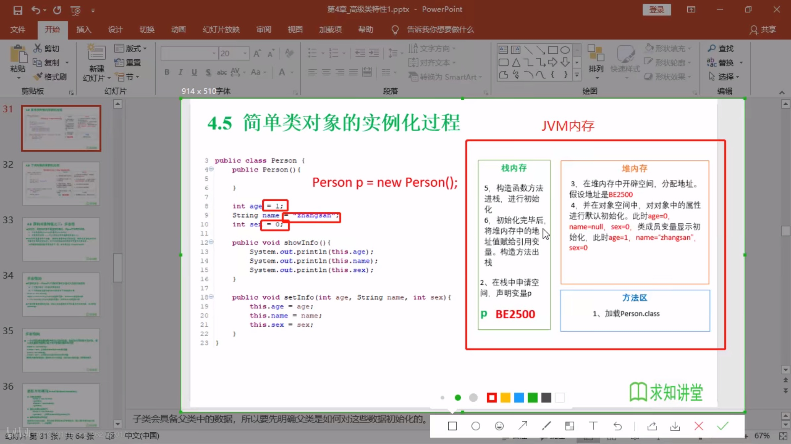
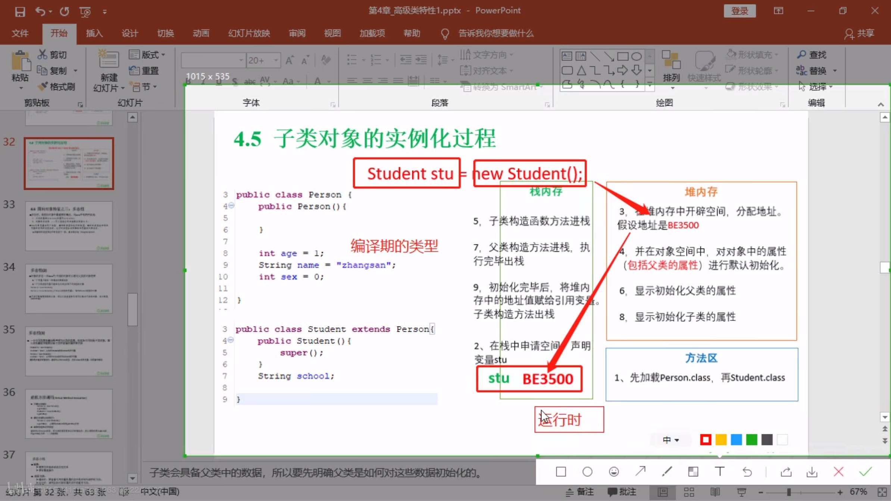
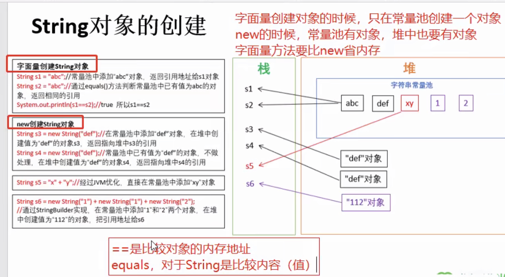
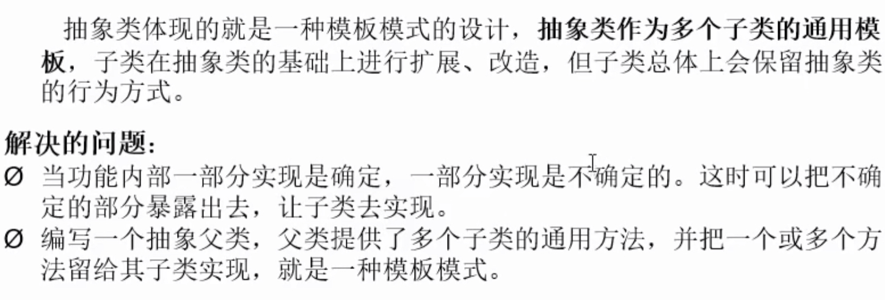
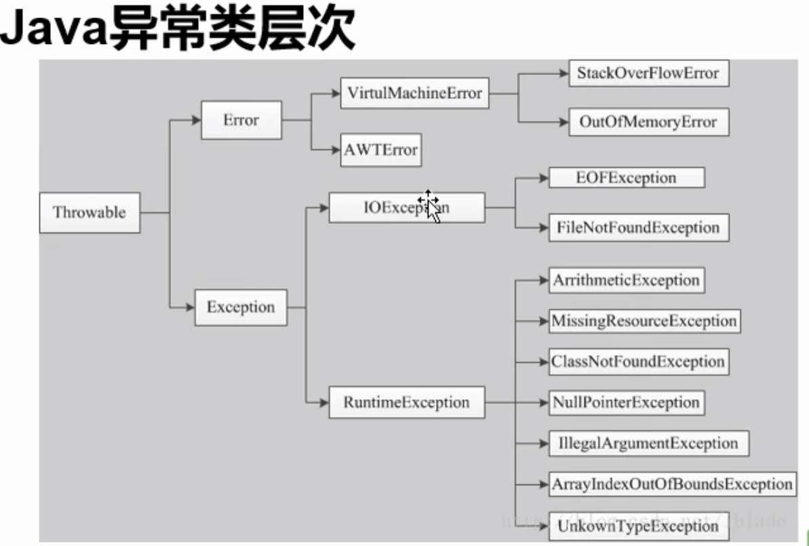

# day_1

## 常用dos命令

+ **dir**:列出当前目录下的文件及文件夹
+ **md**:创建目录
+ **rd**:删除目录
+ **cd**:进入指定目录
+ **cd**..:返回上一级目录
+ **cd**\:返回根目录
+ **del**:删除文件
+ **exit**:退出

## Java 两种核心机制：

+ Java虚拟机，`JVM`
+ 垃圾回收机制，`GC`

语言特点：

+ 跨平台性

## JDK,JRE,JVM

+ `JDK`是包含了java开发的工具包
+ `JRE`是包括JVM和java程序所需的核心类库
+ JDK包含JRE包含`JVM`

# day_2

+ 关键字:专门用途，勿作他用

+ 保留字:可能在java以后版本作为关键字使用的单词

## 数据类型

+ 基本数据类型

  + 数值型
    - [x] 整数类型:`int`（4字节）,`short`（2字节）,`long`（8字节）,`byte`（1字节=8bit）
    - [x] 浮点数类型:`float`,`double`

  + 字符型:`char`
  + 布尔型:`boolen`

+ 引用数据类型(可以在初始化的时候赋值为`null`)

  + 类:`class`(`string` 在里面)

    + `String`:不可变类，创建的对象不可更改。

      ```java
      String s0 = "hello";
      String s1 = "hello";
      String s2 = "he" + "ll" + "o";
      //内存中只有一个"hello"
      ```

  + 接口:`interface`

  + 数组:`[]`

+ `long`类型赋值时需+L: 

  ```java
  long l  = 3L;
  ```

+ 定义浮点型时默认为`double`,而需定义`float`类型时需+f\F:

  ```java
  float f = 3.0f;
  ```

+ 基本数据类型转换

  + 自动转换:`char`,`byte`,`short`--->`int`--->`long`--->`float`--->`double`
  + `char`,`byte`,`short`不会相互转换，都转换为`int`类型再计算

  + 有多种数据混合运算时，系统先转换为容量较大的类型

  + 多个相同类型变量计算时，系统先转换为对应的默认类型

## 运算符

+ 算术
+ 赋值
+ 比较
+ 逻辑
+ 位运算符

## 转义字符


# day_3

Lue（同C）

# day_4

## 一维数组初始化

+ 动态初始化:先声明，后赋值

+ ```java
  int[] arr = new int[4];
  arr[0] = 1;
  arr[1] = 2;
  ```

+ 静态初始化:声明时变赋值

  + ```java
    int[] arr = new int[]{1, 2, 3};
    int[] arr = {1,2,3};
    ```

+ 每个数组都有一个属性:straight_ruler:length

+ 默认初始化

  ```java
  int[] arr = new int[4];
  //默认值都为0
  ```

## 二维数组

+ 初始化

  ```java
  int[][] arr1 = new int[][]{
      {1,2}, 
      {3,5}
  };
  
  int[][] arr2 = new int[2][3];
  
  int[][] arr3 = new int[2][];//二维不定义
  
  int[] arr4[] = new int[1][2];
  ```

+ 遍历二维数组

  ```java
  for (int i = 0; i < arr.length; i++) {        
      for (int j = 0; j < arr[i].length; j++) { 
          System.out.println(arr[i][j]);        
      }                                              
  }                                                  
  ```


## for each

**「for each 循环语句不能自动处理多维数组的每一个元素，它是按照行， 也就是一维数组处理的」**

```java
int[][] a = { 
  {16, 3, 2, 13},
  {5, 10, 11, 8}, 
  {9, 6, 7, 12}, 
  {4, 15, 14, 1} 
};
//遍历e
for(int[] row : a) { // 遍历每一行
  for(int value : row) { // 遍历每一列
   System.out.println(value);
  }
}
```


# day_5

## 面向对象

+ 三大特性：
  + 封装
  + 继承
  + 多条

### class类

+ 属性
+ 方法

```java
public class Person {
    //属性,成员变量，类的成员变量可以先声明，不用初始化，且有默认值
    private String name;//姓名，String默认值位null
    private int age;//年龄，int的默认值位0
    
    //方法
    /*
    * 打印姓名*/
    public void showName() {
        System.out.println(name);
    }
    /*
    *获取年龄
    */
    public int getAge() {
        return age;
    }
}
```

#### 实例化类（创建对象）

```java
Person p = new Person();//声明一个Person类型变量
/*
可以给属性赋值，并调用方法
*/
```

####  属性

+ 语法格式:

  ```java
  //修饰符 类型 属性名 (= 初值);
  ```

  + 修饰符
    + `private`: 该属性只能由类内部访问
    + `public`:内外均可访问
    + `default`:类内部，包内部访问
    + `protected`:类内部，包内部，子类可以访问
  + 类型：基本数据类型

+ 变量

  + 成员变量

    + 实例变量：只有将类实例化成对象之后才能使用

      ```java
      private String name;//姓名，String默认值位null
      private int age;//年龄，int的默认值位0
      ```

    + 类变量：static修饰，不需要类实例化成对象就可使用，直接通过类名调用

      ```java
      public static String gender = "male";
      ```

  + 局部变量

#### 方法

+ 语法格式

  ```java
  //修饰符 返回值类型 方法名 (参数s) {
  	方法体;
  }
  ```

  + 修饰符
    + `public`
    + `private`
    + `protected`
    + `default`
  + 返回值类型:return；void

> 注：方法中不能再定义方法（禁止套娃）

#### 关于对象

##### 匿名对象

+ 不定义对象的句柄，直接调用这个对象的方法

```java
new Person().shout();
```

+ 使用情况
  + 适用于只调用一次方法
    + 将匿名对象作为实参传递给一个方法调用

> 提示：
>
> 1.在一个类中，类的方法可以直接访问类中的成员变量。（例外，static方法中访问非static，编译不通过）
>
> 2.在不同类中，要先创建要访问的类的对象，再用对象访问类中定义的成员。

#### 方法重载

+ 概念：在一个类中，出现同名方法，方法中的参数个数或类型不同。
+ 特点：与返回值类型无关，只看***参数列表***，且参数列表***必须不同***。

```java
public int add(int x, int y) {
    return x + y;
}
//参数个数不同    
public int add(int x, int y, int z) {
    return x + y + z;
}
```

```java
public int add(int x, int y) {
    return x + y;
}
//参数类型不同    
public int add(int x, double y) {
    return x + y
}
```

```java
public double add(double x, int y) {
    return x + y;
}
//顺序不同     
public double add(int y, double x) {
    return x + y
}
```

# day_6

## 可变个数的形参

```java
//用数组方式
//如果没有参数，调用时就要定义一个空数组或者null
public void printInfo(String[] args) {
    for(int i = 0;i < args.length;i++) {
        System.out.println(args[i]);
    }
}
//用java特有的...方式，与String[] args相同用法
//如果没有参数，调用时可以不填
//方法有多个形参，可变形参(...)放在所有参数之后
public void printInfo1(int x, String... args) (对)
public void printInfo1(String... args, int x) (错)
public void printInfo1(String... args) {
    for(int i = 0;i < args.length;i++) {
        System.out.println(args[i]);
    }
}
```

> **使用方法与数组一样**。

## 方法参数传递

+ 形参
+ 实参

### JVM内存模型


#### 基本数据类型


#### 引用对象 


#### 总结

+ 方法的参数传递
  + 如果方法的形参是**基本数据类型**，那么实参（实际的数据）向形参传递参数时，就是把实参的值**复制**给形参。
  + 如果方法的形参是**对象**，那么实参（实际的对象）向实参传递参数时，就是把实参在**栈中的值---引用对象在堆中的地址**传递给形参。
+ 基本数据类型都保存在栈中，引用对象在栈内存中保存的是引用对象在堆中的地址，方法传递的参数就是传递值（***变量在栈中的值***）。

### package

+ 包类似文件夹

## 封装和隐藏

Java中将数据声明私有化(private)，提供公共(public)方法：get，set对该属性进行操作。

目的：

+ 隐藏类中不需要对外界提供的实现细节
+ 方便加入控制逻辑，限制不合理操作

```java
    private String name;
    private int age;

    public String getName() {
        return name;
    }

    public void setName(String name) {
        this.name = name;
    }

    public int getAge() {
        return age;
    }

    public void setAge(int age) {
        if(age >= 150 || age <=0) {
            System.out.println("不合理");
        } else 
            this.age = age;
    }
```

| 修饰符        | 类内部 | 同一个包 | 子类 | 除上述任何地方 |
| ------------- | ------ | -------- | ---- | -------------- |
| private       | yes    | no       | no   | no             |
| default(缺省) | yes    | yes      | no   | no             |
| proteced      | yes    | yes      | yes  | no             |
| public        | yes    | yes      | yes  | yes            |

> 访问权限

+ 在一个java文件中，只能有一个class由public修饰，其余class只能`缺省(default)`,且default修饰的只能再同一个***包***中使用。

## 类的构造方法

```java
public class Person4 {
    private int age;
    private String name;
//构造方法重载
    public Person4(int age, String name) {
        this.age = age;
        this.name = name;
    }

    public Person4(String name) {
        this.name = name;
    }

    public Person4(int age) {
        this.age = age;
    }
//默认构造器，默认构造器的修饰符与所属类的修饰符相同
    public Person4() {
    }
}
```

> **父类构造器不可被子类继承**

## this关键字

+ this表示当前对象，可以调用类的属性、方法和构造器
+ 使用情况
  + 在方法内部使用，即这个方法所属对象
  + 在构造器内部使用，表示构造器正在初始化的对象

# day_7

## 继承

> 把共性抽取形成父类。
>
> 关键字“extends”，*子类不是父类的子集，而是**父类的扩展**。*
>
> 子类不能访问父类的private修饰的变量。但可通过**get、set**方法访问。


+ Java<u>只能单继承，不能多重继承。</u>
+ 一个子类只能由一个父类，而一个父类可以有多个子类。

### 方法重写(override)

+ 重写方法与被重写方法<u>具有相同的方法名称、参数列表和返回值类型</u>。
+ 重写方法<u>不能使用比被重写方法更严格的访问权限</u>。
+ 重写方法与被重写方法需<u>同时为static或同为非static</u>。

+ <u>子类方法抛出的异常不能大于父类被重写方法的异常</u>。

### super关键字

+ super可以访问父类定义的属性、成员方法
+ super可用于子类构造方法中调用父类的构造器
+ super代表父类内存空间的标识
+ supe可以调用子类之上的**所有**父类层级

#### 调用父类构造器

+ 所有子类构造器会**默认**访问父类中**空参数**的构造器
+ 在父类***只有*****有参构造的时候**，子类**必须**显示的构造一个**调用父类的有参构造**，并且调用父类方法要写在第一行。

```java
public Class Person{
    public Person(String name) {//带参构造方法

   }
}

public class P extends Person{//子类必须显示的构造一个调用父类的有参构造
    public P(String name) {
        super(name);
    }
}
```


### this与super的区别

| 序号 | 区别点     | this                                   | super                        |
| ---- | ---------- | -------------------------------------- | ---------------------------- |
| 1.   | 访问属性   | 访问本类属性，如果本类没有，则访问父类 | 只访问父类属性               |
| 2.   | 调用方法   | 访问本类方法，如果本类没有，则访问父类 | 只访问父类方法               |
| 3.   | 调用构造器 | 调用本类构造器，必须放在首行           | 调用父类构造器，必须放在首行 |
| 4.   | 特殊情况   | 表示***当前对象***                     | 无                           |







## 多态

### 体现：

+ 方法重载：本类的同名方法，体现相同的名称方法实现不同的逻辑
+ 方法重写：子类对父类方法的覆盖，子类可以使用和父类相同的方法名，覆盖父类的逻辑；父类的方法，***想修改逻辑，但有别的代码在调用父类方法，这时考虑子类继承父类，如何重写父类方法。***

+ 对象的多态性---子类对象可以代替父类对象使用

  + 一个变量只能有一种确定的数据类型
  + 一个引用类型变量可能指向多个不同类型对象

  ```java
  Person p = new Person();
  Person e = new Student();//引用类型变量e指向Student类型对象
  ```

  > *子类可以看作是特殊的父类*，所以父类类型的引用可以指向子类对象：**向上转型**。

Java引用变量有两个类型：

+ **编译**时类型：由声明该变量时使用的类型决定
+ **运行**时类型：由实际赋给该变量的对象决定

> *若编译时类型和运行时类型不一致，就出现**多态**。*

- [x] 一个引用类型变量如果声明时为父类类型，但实际引用的是子类对象，那该变量就不能访问子类中*添加的属性*。

  ```java
  Student m = new Student();
  m.school = "SHU";
  
  Person e = new Student();
  e.school = "DHU";//非法
  //属性是编译时确定的，编译时e为Person类型，没有school成员变量，因而编译错误。
  ```

### 虚拟方法调用

```java
public class TestDemo {
    public static void main(String[] args) {
        Person p = new Person();
        p.showInfo();

        Student s = new Student();
        s.showInfo();

        Person e = new Student();
        e.showInfo();//输出Student()的showInfo()方法
    }
}
```

> 编译时e为Person类型，而方法调用是运行时确定，所以调用Student()的showInfo()方法。---**动态绑定**

- [x] ***编译看左边，运行看右边。***

### 多态小结

+ 前提：
  + 需要存在继承或实现关系
  + 要有覆盖操作

+ 成员方法
  + 编译时：要查看引用变量所属类是否有所调用的方法
  + 运行时：调用实际对象的成员方法
+ 成员变量：
  + 不具备多态性，只看引用变量所属的类

## instanceof

 作用：检验x是否为类A的子类，返回值为boolean型。

```java
Person p = new Person();

Student s = new Student();

Person e = new Student();

System.out.println(p instanceof Person);//true
System.out.println(s instanceof Student);//true
System.out.println(e instanceof Student);//true
```

## Object类

+ 所以Java类的根父类（基类）

+ 类的声明默认extends Object类

  ```java
  void method(Object obj) {...}//可以接受任何类做为参数	
  ```

  ```java
  p.equals(e);//比较引用对象是否为同一个（地址是否相同）
  p.hashCode();//取得hash码
  p.toString();//取得内存地址
  ```

# day_8

## 对象类型转换

+ 基本数据类型转换

  + 自动类型转换：范围小的数据类型转换为大的数据类型

    ```java
    int i = 1;
    long l = i;//合法
    ```

  + 强制类型转换：范围大的数据类型转换为小的数据类型

    ```java
    long l = 1L;
    int i = l;//非法
    int i = (int) l;//合法
    ```

+ 对象的类型转换

  + *<u>子类到父类可以直接转换</u>*

    ```java
    Person p = new Person();
    Student s = new Student();
    
    p = s;//合法
    ```

  + *<u>父类到子类需要强制转换</u>*

    ```java
    Person p = new Person();
    Student s = new Student();
    
    s = (Student) p;//需强转
    ```

  + *<u>**无继承关系的转换非法**</u>*

## == & equals()

+ **== **<u>*比较对象时*</u>只有指向同一对象时才为true  

+ **equals()** 只能比较引用类型，比较的是是否为同一地址，与==相同

> **特例**：当用equals()方法比较时，对类`File,String,Date,包装类(Wrapper Class)`是比较类型及**内容**时**<u>*不考虑引用的是否为同一对象*</u>**。

+ 如果不想用某一个类的equals()方法比较对象的内存地址，就需要**重写**equals()方法。




### 重写equals()方法

```java
@Override
    public boolean equals(Object obj) {
        if(obj instanceof MyDate) {//判断传入的obj是否为子类
            MyDate m = (MyDate) obj;//如果是，就强制转换
            if(this.month == m.month && this.year == m.year && 	this.day == m.day) {//比较值是否相等
                return true;
            }
        }
        return false;
    }
```

## static关键字

> 有时你希望定义一个类成员，使它的使用完全独立于该类的任何对象。通常情况下，类成员必须通过它的类的对象访问，但是可以创建这样一个成员，它能够被它自己使用，而不必引用特定的实例。在成员的声明前面加上[关键字](https://baike.baidu.com/item/关键字)static（静态的）就能创建这样的成员。如果一个成员被声明为static，它就能够在它的类的任何对象创建之前被访问，而不必引用任何对象。你可以将方法和变量都声明为static。static 成员的最常见的例子是main（）。因为在程序开始执行时必须调用main() ，所以它被声明为static。

> 类属性、类方法：设计类时，不想使属性、方法随对象不同而改变。

> 总而言之，就是方便在**没有创建对象的情况下来进行调用（方法/变量）**。 

### 类变量

+ `static`是不允许用来修饰局部变量，这是java语法的规定。

```java
public class Chinese {
    static String country;//类变量（静态变量），不用实例化，直接类名.属性就可以使用，是类的一部分，被所有这个类的实例化对象共享
    String name;
    int age;//实例变量，只有实例化之后才能使用，属于实例化对象的一部分，不可共享
    
	public static void main(String[] args) {
        Chinese.country = "China";//类名.属性调用
    }
}
```

### 类方法

+ 类名.方法名调用

+ 做`工具类`

+ 方法内不能用`this`和`super()`

  > `static`不依赖于任何对象，既然没有对象，就没有`this`和`super()`了。
  >
  > 并且由于这个特性，在**静态方法**中不能访问类的非静态成员变量和非静态成员方法，因为非静态成员方法/变量都是必须依赖具体的对象才能够被调用。
  >
  > 但是要注意的是，虽然在静态方法中不能访问非静态成员方法和非静态成员变量，但是在非静态成员方法中是可以访问静态成员方法/变量的。

### static代码块

　　static关键字还有一个比较关键的作用就是用来形成静态代码块以优化程序性能。static块可以置于类中的任何地方，类中可以有多个static块。在类初次被加载的时候，会按照static块的顺序来执行每个static块，并且只会执行一次。

## 单例设计模式

+ 避免多次重复实例化对象

```java
/*单例设计模式--饿汉式--只new一次对象*/
public class Single {
    //私有构造，构造方法私有化，调用类时不能直接使用new来创建对象
    private Single() {
        
    }
    //私有的Single类型类变量,只创建一次
    private static Single single = new Single();
    
    public static Single getInstance() {
        return single;
    }
}
```

```java
//调用
public class Test {
    public static void main(String[] args) {
        Single s = Single.getInstance();//类方法，类名.方法
    }
}
```

```java
/*单例设计模式--懒汉式*/
public class Single1 {
    //私有化构造，外界不能直接new对象
    private Single1() {
        
    }
    
    private static Single1 s1 = null;
    //如果实例未创建，就先创建，在返回给调用者
    public static Single1 getInstance() {
        if(s1 == null) {
            s1 = new Single1();
        }
        
        return s1;
    }
}
```

# day_9

## 代码块

```java
public class Person {
    private String name;

    public Person() {
        this.name = "jj";
        System.out.println("执行构造方法");
    }
    //非静态代码块
    {//静态\非静态修饰的属性和方法均可执行
        System.out.println("执行非静态代码块");
    }
    //静态代码块
    static {
        //只能使用静态(static)修饰的属性和方法
        System.out.println(age);
    }
}
```

在new Person()的时候执行步骤：

+ 1.类的属性的默认初始化和显示初始化
+ 2.执行代码块的代码
+ 3.执行构造器的代码

> 注意，如果静态初始化块被调用，那么它会在非静态初始化块之前被调用，也就是说，代码块的调用顺序为：
>
> 1. 静态初始化块
> 2. 非静态初始化块
> 3. 构造函数

> 每次new Person()时：
>
> 非静态代码块重新执行，而静态代码块**只能执行一次**。
>
> 静态代码块执行**<u>*先于*</u>**非静态代码块。

## final

+ final修饰的**类**<u>不能继承</u>；

+ final修饰的**方法**<u>不能被子类重写</u>；

+ final修饰的变量为**常量**，名称大写。

+ final static一起修饰就是**全局常量**。

  + ```java
    final static int A = 1;
    ```

    

## 抽象类

父类设计的非常抽象，以至于没有具体实例。

+ 用abstract关键字修饰类，就是抽象类。

+ 用abstract关键字修饰方法，就是抽象方法。

  > + 抽象方法只有声明，没有方法的实现。

+ **含有抽象方法的类必须声明为抽象类。**

+ 抽象类不能被实例化。抽象类是用来当作父类被继承的，抽象类的子类必须重写父类的抽象方法，并提供方法体。若没有重写全部抽象方法，仍为抽象类。

+ 不能用abstract修饰属性，私有方法，构造器，静态方法，final修饰的方法(**抽象类必须被继承才能实现**)。

```java
public abstract class Animal {
    public abstract void test();
    
    public abstract void move();//抽象类，没有方法体
    
}
```

```java
public abstract class Bird extends Animal{//抽象类也能继承抽象类

    @Override
    public void move() {
        
    }
    
    public abstract void test();//只要有一个抽象方法，类必须为抽象类
}
```

```java
public class Dog extends Animal{   //必须重写抽象类中所有的抽象方法
    @Override
    public void test() {

    }

    @Override
    public void move() {

    }

}
```

## 模板方法设计模式



```java
public abstract class Template {//定义抽象类
    public abstract void code();//定义抽象方法

    public final void getTime() {//得到code()方法执行的时间的方法
        long start = System.currentTimeMillis();
        code();
        long end = System.currentTimeMillis();
        System.out.println("code方法执行的时间为：" + (end - start));
    }
}
```

```java
public class TemplateTest extends Template{
    public void code() {
        for (int i = 0; i < 10000;i++) {
            System.out.print(i + " ");
        }
        System.out.println();
    }

    public static void main(String[] args) {
        TemplateTest templateTest = new TemplateTest();
        templateTest.getTime();
    }
}
```

## 接口

+ 有时必须从几个类中派生出一个子类，继承它们的所有属性和方法。但是，Java不支持多重继承，有了接口，就可以起到多重继承的效果。
+ 接口时抽象方法和常量值的定义的集合。
+ 本质上，**接口是一种特殊的抽象类**，这种抽象类只包含常量和方法的定义，但没有变量和方法的实现。
+ 一个类可以实现多个接口，接口也可以继承其他接口。

> 如果实现接口的类没有实现接口这的全部方法， 那么必须将此类定义为抽象类。

特点：

+ 所有成员变量默认`public static final`修饰
+ 所有成员方法默认`public abstract`修饰
+ 接口没有构造器

```java
public interface TestInterface01 {
    void work();
}
public interface TestInterface02 {
    void work02();
}
```

```java
//类可以同时实现多个接口
public class InterfaceImplement implements TestInterface01,TestInterface02{
    @Override
    public void work01() {

    }

    @Override
    public void work02() {

    }
}
```

```java
//接口可以继承接口，且可以继承多个
public interface TestInterface03 extends TestInterface01, TestInterface02{
    
}
```

**既有继承又有实现🕉**

```java
//先继承后实现
class InterfaceImplement extends Person implements TestInterface01,TestInterface02{
    @Override
    public void work01() {

    }

    @Override
    public void work02() {

    }
}
```

总结：

+ 抽象类是对于一类事物的高度抽象，其中既有属性也有方法。
+ 接口是对方法的抽象，也就是对一系列动作的抽象。
+ 当需要对一类事物抽象的时候，应该使用抽象类，便于形成一个父类。
+ 当需要对一系列动作抽象时，就使用接口，需要使用这些动作的类去实现对应的接口即可。

## 内部类

```java
public class Test3 {
    int i,j,k;

    class A{
        int i = 4;
        public void setTest3() {
            Test3.this.i = 1;//内部类访问外部类
            Test3.this.j = 2;
            Test3.this.k = 3;
        }
    }

    public void setInfo() {
        new A().setTest3();//外部类访问内部类
        new A().i = 5;
    }

    public void showInfo() {
        System.out.println(this.i);
        System.out.println(this.j);
        System.out.println(this.k);
    }

    public static void main(String[] args) {
        Test3 test3 = new Test3();
        test3.setInfo();
        test3.showInfo();
    }
}
```


# day_10

## Java异常

+ `error`：JVM系统内部错误、资源耗尽
+ `exception`：`ArrayIndexOutOfBoundsException`、`NullPointerException`、`ArithmeticException: / by zero`、`ClassCastException`

```java
public class Test {
    public static void main(String[] args) {
        String[] strings = new String[]{"a","b","c"};						System.out.println(strings[3]);
        //ArrayIndexOutOfBoundsException数组越界异常
    }
}
```

```java
public class Test {
    public static void main(String[] args) {
        A a = null;
        System.out.println(a.i);//引用变量a没有指向任何变量
        //NullPointerException空指针异常
    }
}
class A{
    int i;
}
```



## 异常处理机制

```java
try{//用try{}来括住可能出现异常的代码
    System.out.println(1/0);
} catch (Exception e) {//当不知道什么类型的异常时，使用所有异常的父类exception
//            e.printStackTrace();//输出异常，且不中断代码:用来追踪异常事件发生时执行堆栈的内容
      e.getMessage();//用来得到有关异常事件的信息
} finally {
    //可写可不写，它是捕获异常的体系最终一段执行的部分。
}
```

```java
public class Test02 {
    public static void main(String[] args) {
        int[] arr = new int[]{1,2,3};
        B b = null;
        try{
            System.out.println(arr[3]);
            //如果前一段代码有异常，就不会继续执行
            System.out.println(b.i);
        } catch (ArrayIndexOutOfBoundsException e1) {
            e1.printStackTrace();
        } catch (NullPointerException e2) {
            e2.printStackTrace();
        }
//多个catch，多次捕获 
        System.out.println("=====");
    }
}
class B{
    int i;
}
```

```java
public class Test03 {
    public static void main(String[] args) throws Exception {
        //在main方法中抛出异常直接抛到虚拟机上去了，在程序中不能处理
        C c = new C();
//        try {//throws在代码处抛出的异常，在调用方法去捕获
//            c.test();
//        } catch (Exception e) {
//            e.printStackTrace();
//        }
        c.test();
    }
}

class C{
    int i;
    public void test() throws Exception{//可以使用throws在代码处抛出异常，在调用方法去捕获异常
        C c = null;
        System.out.println(c.i);
    }
}
```

+ 子类方法抛出的异常不能大于父类被重写方法的异常。

```java
class C{
    int i;//NullPointerException的父类时Exception
    public void test() throws NullPointerException{//可以使用throws在代码处抛出异常，在调用方法去捕获异常
        C c = null;
        System.out.println(c.i);
    }
}

class D extends C{
    @Override
    public void test() throws Exception {//报错
        //
    }
}
```

### 人工抛出异常

```java
public void test0(int age) throws Exception {
     if (age >=0 && age <= 150) {
         System.out.println("年龄：" + age);
     } else {
         throw new Exception("年龄应在0~150");
     }
}
```

创建用户自定义异常类


## 集合

> 集合是用来存放对象的容器。

+ 集合只能存放对象。
+ 集合存放的是多个对象的引用，对象本身还是在堆内存中存放。
+ 集合可以存放不同类型，不限数量的数据类型。

Java集合分为Set、List、Map.

### HashSet

+ 不可重复
+ 不能保证排列顺序(根据hashCode决定)

```java
        Set set = new HashSet();

        set.add(1);//添加元素
        set.add("a");

        set.remove(1);//移除元素

        System.out.println(set.contains("a"));//判断元素是否存在
        
        set.clear();//清空元素

        System.out.println(set);
```

```java
//使用迭代器遍历集合
        Iterator it = set.iterator();
        while (it.hasNext()) {
            System.out.println(it.next());
        }
```

```java
 //for each迭代集合
        for (Object obj: set) {
            System.out.println(obj);
        }
```

```java
//获取集合元素个数
        System.out.println(set.size());
```

```java
//判断是否为空
        System.out.println(set.isEmpty());
```

HashSet集合判断两个元素相等的标准：

两个对象通过equals()方法比较相等，并且两个对象的hashCode()方法返回的值也相等。

```java
//使用泛型：集合只存储同样类型的对象
        Set<String> set1 = new HashSet<String>();

        set1.add("a");
```

### TreeeSet

> 有序、不可重复。

```java
Set<Integer> set = new TreeSet<Integer>();
//TreeSet自然排序
set.add(1);
set.remove(1);
set.contains(1);
set.clear();
set.isEmpty();
//迭代器
Iterator<Integer> it = set.iterator();
while (it.hasNext()) {
    System.out.println(it.next());
}
for (Integer i :set
    ) {
        System.out.println(i);
}
```

> 必须放入统一类型变量。

+ ```java
  //定制排序：想要让TreeSet按Person的age排序怎么办
  ```

  **定制排序**：需要在创建TreeSet集合时，提供一个Comparator接口实现的类对象。

```java
import java.util.Comparator;

public class Person implements Comparator<Person> {//一个Comparator接口实现的类对象
    int age;
    String name;

    public Person() {
    }

    public Person(int age, String name) {
        this.age = age;
        this.name = name;
    }
    //想要让TreeSet按Person的age排序
    @Override
    public int compare(Person o1, Person o2) {
        if(o1.age > o2.age) {
            return 1;
        } else if(o1.age < o2.age){
            return -1;
        } else
            return 0;
    }
}
```

```java
import java.util.Set;
import java.util.TreeSet;

public class Test03 {
    public static void main(String[] args) {
        Person p1 = new Person(25, "zjx");
        Person p2 = new Person(22, "zju");
        Person p3 = new Person(21, "zjr");
        Person p4 = new Person(23, "zjq");

        Set<Person> set = new TreeSet<Person>(new Person());

        set.add(p1);
        set.add(p2);
        set.add(p3);
        set.add(p4);

        for (Person p: set
             ) {
            System.out.println(p.name + ":  " + p.age);
        }
    }
}
```

### List集合

+ 元素有序且可重复，每个元素都有相应的索引。

```java
//创建元素
        List<String> list1 = new ArrayList<String>();
        List<String> list2 = new ArrayList<String>();
        //添加元素
        list1.add("a");
        list1.add("c");
        list1.add("d");
        list1.add("b");
        list1.add("g");
        list1.add("d");

        list2.add("1");
        list2.add("2");
        list2.add("3");
        //在指定索引位置插入数据
        list1.add(1, "a");
        //在指定索引位置插入整个list
        list1.addAll(1, list2);
        //通过索引查看元素
        System.out.println(list1.get(0));
        //获取指定元素在集合中第一次出现的索引下标
        System.out.println(list1.indexOf("d"));
        //获取指定元素在集合中最后一次出现的索引下标
        System.out.println(list1.lastIndexOf("d"));
        //移除元素
        list1.remove("a");
        list1.remove(1);
        //根据指定索引下标修改元素
        list1.set(1, "aa");
        //截取元素形成新的集合
        List<String> subList = list1.subList(1, 4);
        System.out.println(subList);
```

### Map集合

Map由于保存映射数据。有key和value。可以时任何引用类型数据，key不允许重复。不保证顺序。

[Java HashMap | 菜鸟教程 (runoob.com)](https://www.runoob.com/java/java-hashmap.html)

#### TreeMap

+ 所有的key应该是同一个类。

+ 自然排序指的是字典排序。

## Collections工具类

+ 操作集合。

```java
Collections.reverse(list); //反转
```

```java
Collections.shuffle(list);//随机排序
```

```java
Collections.sort(list);//升序排序	
```

# day11

## 泛型

> 解决数据类型安全性问题。

+ 泛型只在编译阶段有效，泛型不会进入到运行时阶段。

```java
 List<Integer> list = new ArrayList<Integer>();
```

### 泛型方法

```java
/*泛型方法*/
public class Test2 {
    public static void main(String[] args) {
        S<Object> s = new S<Object>();
        s.test2("a", "v", 1, 3, 1);
    }
}

class S<E> {
    private E e;
    //静态方法不能使用类定义的泛型
    public static void test3() {
//        System.out.println(e);
    }
    public <T> void test(T t) {
        System.out.println(t);
    }

    public <T> T test1(T t) {
        return t;
    }

    public <T> void test2(T... ts) {
        for (T t: ts
             ) {
            System.out.println(t);
        }
    }
}
```

### 泛型接口

```java
interface IB<T> {
    T test(T t);
}
/*未传入泛型实参时，与泛型类的定义相同，在声明类的时候，需将泛型的声明一起加入到类中*/
class B1<T> implements IB<T> {

    @Override
    public T test(T t) {
        return t;
    }
}

class B2 implements IB<String> {
//调用时不用指定泛型
    @Override
    public String test(String s) {
        return s + "指定泛型";
    }
}	
```

### 泛型通配符

> 不确定集合中元素具体的数据类型
>
> 使用`？`表示所有类型.

**有限的通配符**

```java
//只允许泛型为Person及Person子类的引用调用
<? extends Person>
//只允许泛型为Person及Person父类的引用调用
<? super Person>
//只允许泛型为Comparable接口的实现类的引用调用
<? extends IA>
    //IA为接口
```

### 可能遇到的坑

#### 泛型-当泛型遇到重载

```java
public class GenericTypes {

    public static void method(List<String> list) {  
        System.out.println("invoke method(List<String> list)");  
    }  

    public static void method(List<Integer> list) {  
        System.out.println("invoke method(List<Integer> list)");  
    }  
}  

```

> 上面这段代码，有两个重载的函数，因为他们的参数类型不同，一个是List，另一个是List，但是，这段代码是编译通不过的。参数List和List编译之后都被擦除了，变成了一样的原生类型List，擦除动作导致这两个方法的特征签名变得一模一样。

#### 当泛型遇到catch

> 泛型的类型参数不能用在Java异常处理的catch语句中。因为异常处理是由JVM在运行时刻来进行的。由于类型信息被擦除，JVM是无法区分两个异常类型MyException和MyException的。

#### 当泛型内包含静态变量

```java
public class StaticTest{
    public static void main(String[] args) {
        GT<Integer> gti = new GT<Integer>();
        gti.var = 1;
        GT<String> gts = new GT<String>();
        gts.var = 2;
        System.out.println(gti.var);
    }

    class GT<T> {
        public static int var = 0;

        public void nothing(T x) {
        }
    }

```

> 这段代码编译都无法通过，因为泛型里面不能引用静态变量。由于经过类型擦除，所有的泛型类实例都关联到同一份字节码上，泛型类的所有静态变量是共享的。

## 枚举

```java
public class Test {
    public static void main(String[] args) {
        Season.SPRING.showInfo();//每次执行Season.SPRING获得的是相同的对象，枚举类每个枚举都是单例模式。
    }
}

enum Season {
    //相当于调用构造方法
    SPRING("Spring", "A"),
    SUMMER("Summer", "B"),
    AUTUMN("Autumn", "C"),
    WINTER("Winter", "D");

    private final String NAME;
    private final String DESC;

    Season(String NAME, String DESC) {
        this.NAME = NAME;
        this.DESC = DESC;
    }

    public void showInfo() {
        System.out.println(this.NAME + ", " + this.DESC);
    }
}
```

### 实现接口

```java
enum Season1 implements IA{
    @Override
    public void test() {
        
    }
}
```

## 注解

> 方法上可以进行注解，类上也可以注解，字段属性上也可以注解，反正几乎需要配置的地方都可以进行注解。注解也叫**元数据**，即一种描述数据的数据。用于对代码进行说明，可以对包、类、接口、字段、方法参数、局部变量等进行注解。

**一个注解准确意义上来说，只不过是一种特殊的注释而已，如果没有解析它的代码，它可能连注释都不如。**

### 注解本质

**<u>*注解的本质就是一个继承了 Annotation 接口的接口。*</u>**

### 注解的用途

1. 生成文档，通过代码里标识的元数据生成javadoc文档。
2. 编译检查，通过代码里标识的元数据让编译器在编译期间进行检查验证。
3. 编译时动态处理，编译时通过代码里标识的元数据动态处理，例如动态生成代码。
4. 运行时动态处理，运行时通过代码里标识的元数据动态处理，例如使用反射注入实例

### 注解的分类

1.Java自带的标准注解，包括`@Override`（<u>标明重写某个方法</u>）、`@Deprecated`（<u>标明某个类或方法过时</u>）和`@SuppressWarnings`（<u>标明要忽略的警告</u>），使用这些注解后编译器就会进行检查。

+ `@Override`: 重写
+ `@Deprecated`：已过时
+ `@SuppressWarnings`(params): 抑制编译器警告，一般传递`"all"`

2.元注解，元注解是用于定义注解的注解，包括`@Retention`（标明注解被保留的阶段）、`@Target`（标明注解使用的范围）、`@Inherited`（标明注解可继承）、`@Documented`（标明是否生成javadoc文档）
3.自定义注解，可以根据自己的需求定义注解

### 自定义注解

```java
@Target(ElementType.FIELD)//表示这个注解类给其他类的属性做注解
@Retention(RetentionPolicy.RUNTIME)//表示定义注解的生命周期
@interface TestAnn {
    public int id() default 0;
    
    public String desc() default "";
}   

class A {
    @TestAnn(id=1, desc = "abc")
    String name;
}
```

### 注解的属性

接口中可以定义的成员方法。

要求：

+ 属性的返回值类型
  + 基本数据类型
  + String
  + 枚举
  + 注解
  + 以上类型的数组
+ 使用注解时，需要给属性赋值
  + 如果定义属性时，使用`default`关键字给属性默认初始化值，则使用注解时不用初始化默认值。
  + 如果**只有一个属性**需要赋值，且属性的名称为`value`，则使用注解时`value`可以省略，直接定义即可。
  + 数组赋值时，值使用{}包裹。如果数组中只有一个值，则{}省略。
+ 在程序解析注解：获取注解中定义的属性值
  + 获取注解定义位置的对象（Class，Method，Field）
  + 获取指定的注解
    + `getAnnotation(Class)`
  + 调用注解中的抽象方法获取配置的属性值

```java
		//1.解析注解
        //1.1获取该类的字节码文件
        Class<ReflectTest> reflectTestClass = ReflectTest.class;
        //2.获取上边的注解对象
        //其实就是在内存中生产了一个该注解接口的子类实现对象
        /*
         * public class ProImpl implement Pro {
         *   public String className() {
         *       return "com.it.annotation.Demo1";
         *   }
         *
         *   public String methodName() {
         *       return "show";
         *   }
         * }
         * */
        Pro an = reflectTestClass.getAnnotation(Pro.class);
        //3.调用注解对象中调用的抽象方法，获取返回值
        String className = an.className();
        String methodName = an.methodName();

        Class<?> clazz = Class.forName(className);
        Object object = clazz.newInstance();
        Method method = clazz.getMethod(methodName);
        method.invoke(object);
```

### 元注解

元注解有 `@Retention`、`@Documented`、`@Target`、`@Inherited`、`@Repeatable` 5 种。

#### @Retention

> 描述注解保留的阶段

Retention 的英文意为<u>保留期</u>的意思。当 @Retention 应用到一个注解上的时候，它解释说明了这个注解的的存活时间。

它的取值如下：

+ `RetentionPolicy.SOURCE` 注解只在**源码阶段**保留，在编译器进行编译时它将被丢弃忽视。
+ `RetentionPolicy.CLASS` 注解只被保留到**编译进行的时候**，它并不会被加载到 JVM 中。如Java内置注解，@Override、@Deprecated、@SuppressWarnning
+ `RetentionPolicy.RUNTIME` 注解可以保留到**程序运行的时候**，它会被加载进入到 JVM 中，所以在程序运行时可以获取到它们。如SpringMvc中的@Controller、@Autowired、@RequestMapping等。

#### @Documented

> 描述注解是否被抽取到api文档中

作用是能够将注解中的元素包含到 `Javadoc` 中去。

#### @Target

> 描述注解能够作用的位置

Target 是目标的意思，@Target 指定了注解运用的地方。

当一个注解被 @Target 注解时，这个注解就被限定了运用的场景。

类比到标签，原本标签是你想张贴到哪个地方就到哪个地方，但是因为 @Target 的存在，它张贴的地方就非常具体了，比如只能张贴到方法上、类上、方法参数上等等。@Target 有下面的取值:

+ `ElementType.TYPE` 只能给一个**类**进行注解，比如类、接口、枚举
+ `ElementType.METHOD` 可以给**方法**进行注解
+ `ElementType.FIELD` 可以给**属性**进行注解
+ `ElementType.CONSTRUCTOR` 可以给**构造方法**进行注解
+ ElementType.ANNOTATION_TYPE 可以给一个注解进行注解
+ ElementType.LOCAL_VARIABLE 可以给局部变量进行注解
+ ElementType.PACKAGE 可以给一个包进行注解
+ ElementType.PARAMETER 可以给一个方法内的参数进行注解

#### @Inherited

> 描述注解是否被子类继承

Inherited 是继承的意思，但是它并不是说注解本身可以继承，而是说如果一个超类使用了@Inherited 注解，那么如果它的子类没有被任何注解应用的话，那么这个**子类就继承了超类的注解。**

#### @Repeatable

Repeatable使用场景：在需要对同一种注解多次使用时，往往需要借助@Repeatable。

## 注解小结

+ 大多数情况下是使用注解，而不是定义注解
+ 注解是给编译器和解析程序用的
+ 注解不是程序的一部分，可以理解为注解就是一个标签

# day_12

## File类对象

```java
//文件读取的方式
//pathname的不同写法
File f1 = new File("D:\\LEARN\\java\\Java_new_learning\\src\\day_12\\a.txt");
File f2 = new File("D:\\LEARN\\java\\Java_new_learning\\src", "day_12\\a.txt");
File f3 = new File("D:/LEARN/java/Java_new_learning/src/day_12/a.txt");
File f4 = new File("D:" + File.separator + "/LEARN/java/Java_new_learning/src/day_12/a.txt");
File f5 = new File("day_12/a.txt");
```

+ ```java
  //获取文件名称或文件夹名称
  f.getName();
  ```

+ ```java
  //获取文件路径或文件名，就是new File时写的路径
  f.getPath();
  ```

+ ```java
  //获取绝对路径
  f.getAbsolutePath();
  ```

+ ```java
  //获取用当前文件夹的绝对路径构建的File对象
  f.getAbsoluteFile();
  ```

+ ```java
  //返回当前文件夹名称或父级路径
  f.getParent();
  ```

+ ```java
  //给文件或文件夹重命名
  f.renameTo(new File(pathname));
  ```

+ ```java
  //判断文件或文件夹是否存在
  f.exists();
  ```

+ ```java
  //判断文件是否可读
  f.canRead();
  ```

+ ```java
  //判断文件是否可写
  f.canWrite();
  ```

+ ```java
  //判断当前file对象是不是文件
  f.isFile();
  ```

+ ```java
  //判断当前file对象是不是文件夹或目录
  f.isDirectory();
  ```

+ ```java
  //获取文件的最后修改时间
  f.lastModified();
  ```

+ ```java
  //获取文件长度
  f.length();
  ```

+ ```java
  File f = new File(pathname);//创建文件
  ```

+ ```java
  if(!f.exists()) {//判断是否存在
      try {
          f.createNewFile();//创建新的文件
      } catch (IOException e) {
          e.printStackTrace();
      }
  }
  ```

+ ```java
  f.delete();//删除文件
  ```

+ ```java
  File f = new File("D:\\test");
  f.mkdir();//创建单层目录
  ```

+ ```java
  File f1 = new File("D:\\test\\a\\b\\c\\d");
  f1.mkdirs();//创建多层目录
  ```

+ ```java
  for (String s: f.list()//返回当前文件夹的子集，包括目录和文件夹
       ) {
      System.out.println(s);
  }
  ```

+ ```java
  for (File s: f.listFiles()//返回当前文件夹的子集的路径
       ) {
      System.out.println(s);
  }
  ```

+ ```java
  public static void test(File f) {//递归遍历目录和文件
      if (f.isFile()) {
          System.out.println(f.getAbsolutePath() + " is a file.");
      } else {
          System.out.println(f.getAbsolutePath() + " is a directory.");
          File[] files = f.listFiles();
          if(files != null && files.length > 0) {
              for (File ff: files
                   ) {
                  test(ff);
              }
          }
      }
  }
  ```

## 文件字节流

```java
 public static void testFileInputStream() {
        try {
            FileInputStream in = new 						  			             FileInputStream("D:\\Test\\IMG_1127.jpg");

            byte[] b = new byte[1000000];//设置一个byte数组读取文件的内容

//            in.read(b);//in.read方法有一个返回值，返回值是读取的数据的长度，如果读取到最后一个数据，就会返回-1

            int len = 0;

            while ((len = in.read(b)) != -1) {
                System.out.println(new String(b, 0, len));
                //new String(b, 0, len)参数1是缓冲数据的数组，参数2是开始转化字符串的位置，参数3是总共转换的字符数
            }
//            System.out.println(new String(b));

            in.close();//使用后需要关闭

        } catch (Exception e) {
            e.printStackTrace();
        }
```

```java
public static void testFileOutputStream() {
    try {
        FileOutputStream out = new FileOutputStream("D:\\Test\\a.txt");
        String str = new String("a");
        out.write(str.getBytes());//把数据写道内存
        out.flush();//把内存中的数据刷写到硬盘
        out.close();//关闭流
    } catch (Exception e) {
        e.printStackTrace();
    }
}
```

```java
public static void copyFile(String inPath, String outPath) {
    try {//文件、图片都可
        FileInputStream in = new FileInputStream(inPath);
        FileOutputStream out = new FileOutputStream(outPath);

        byte[] b = new byte[100000000];

        int len = 0;

        while ((len = in.read(b)) != -1) {
            out.write(b, 0, len);//写入文件，参数1表示要写入的缓冲数组，参数2是数组开始的位置，参数3是结束的位置
        }

        out.flush();
        out.close();
    } catch (Exception e) {
        e.printStackTrace();
    }
}
```

## 文件字符流

```java
public static void testFileReader(String inPath) {
    try {
        //创建文件字符输入流的对象
        FileReader fr = new FileReader(inPath);

        char[] ch = new char[1024];//创建字符数组

        int len = 0;

        while ((len = fr.read(ch)) != -1) {
            System.out.println(new String(ch, 0, len));
            //字符名，开始位置，结束位置
        }

        fr.close();
    } catch (Exception e) {
        e.printStackTrace();
    }
}
```

```java
public static void testFileWriter(String text, String outPath) {
    try {
        FileWriter fw = new FileWriter(outPath);

        fw.write(text);//写到内存

        fw.flush();//刷入硬盘

        fw.close();//关闭流
    } catch (Exception e) {
        e.printStackTrace();
    }
}
```

```java
public static void copyFile(String inPath, String outPath) {//文件字符
    try {
        FileReader fr = new FileReader(inPath);
        FileWriter fw = new FileWriter(outPath);

        char[] ch = new char[1024];

        int len = 0;

        while ((len = fr.read(ch)) != -1) {
            fw.write(ch, 0, len);
        }

        fw.flush();

        fw.close();
        fr.close();
    } catch (Exception e) {
        e.printStackTrace();
    }
}
```

## 缓冲字节流

```java
public static void testBufferedInputStream() throws Exception {
    //创建文件字节输入流对象
    FileInputStream in = new FileInputStream("D:/Test/a.txt");
    //把文件字节输入流放到缓冲字节输入流对象
    BufferedInputStream br = new BufferedInputStream(in);

    byte[] b = new byte[1024];

    int len = 0;

    while ((len = br.read(b)) != -1) {
        System.out.println(new String(b, 0, len));
    }

    //关闭流时：最晚开的最早关，依次关
    br.close();
    in.close();
}
```

```java
public static void testBufferedOutputStream(String text, String outPath) throws Exception {
    //创建字节输出流对象
    FileOutputStream out = new FileOutputStream(outPath);
    //把字节输出流放到缓存字节输出流中
    BufferedOutputStream bo = new BufferedOutputStream(out);

    bo.write(text.getBytes());

    bo.flush();
    bo.close();
    out.close();
}
```

```java
public static void copyFile(String inPath, String outPath) throws Exception {
    BufferedInputStream bi = new BufferedInputStream(new FileInputStream(inPath));
    BufferedOutputStream bo = new BufferedOutputStream(new FileOutputStream(outPath));

    byte[] b = new byte[1024];
    int len = 0;
    while((len = bi.read(b)) != -1) {
        bo.write(b, 0, len);
    }

    bo.close();
    bi.close();

}
```

## 缓冲字符流

```java
public static void testBufferedFileReader(String inPath) throws Exception {
    BufferedReader br = new BufferedReader(new FileReader(inPath));
    char[] ch = new char[100];
    int len = 0;
    while ((len = br.read(ch)) != -1) {
        System.out.println(new String(ch, 0, len));
    }
    br.close();
}
```

```java
public static void testBufferedFileWriter(String text, String outPath) throws Exception {
    BufferedWriter bw = new BufferedWriter(new FileWriter(outPath));

    bw.write(text);

    bw.flush();
    bw.close();
}
```

```java
public static void copyFile(String inPath, String outPath) throws Exception {
    BufferedReader br = new BufferedReader(new FileReader(inPath));
    BufferedWriter bw = new BufferedWriter(new FileWriter(outPath));

    char[] ch = new char[100];
    int len = 0;
    while ((len = br.read(ch)) != -1) {
        bw.write(ch);
    }

    bw.flush();
    bw.close();
    br.close();
}
```

## 转换流

```java
public static void testInputStreamReader() throws Exception{
    /*转换字节输入流为字符输入流*/
    FileInputStream fs = new FileInputStream("D:/Test/a.txt");
    InputStreamReader in = new InputStreamReader(fs, StandardCharsets.UTF_8);

    char[] c = new char[100];
    int len = 0;
    while ((len = in.read(c)) != -1) {
        System.out.println(new String(c, 0, len));
    }

    in.close();
    fs.close();
}
```

```java
public static void testOutputStreamWriter(String Path) throws Exception {
    /*转换字节输出流为字符输出流*/
    OutputStreamWriter os = new OutputStreamWriter(new FileOutputStream(Path), StandardCharsets.UTF_8);
    os.write("abc");

    os.flush();
    os.close();

}
```

## 标准输入输出流

```java
public static void writeToFile(String outPath) throws Exception {
    //创建一个接受键盘输入数据的输入流
    InputStreamReader is = new InputStreamReader(System.in);

    //把输入流放到缓冲流里
    BufferedReader br = new BufferedReader(is);

    //创建缓冲输出流
    BufferedWriter bw = new BufferedWriter(new FileWriter(outPath));

    String str = "";

    while ((str = br.readLine()) != null) {
        if (!str.equals("exit")) {
            bw.write(str);
        } else {
            break;
        }
    }
```


# day_14

## 反射

<u>反射中的这个 “反” 我们就可以理解为根据对象找到对象所属的类（对象的出处）</u>

> <u>反射机制</u>：通过一个抽象的类名能够在**加载类的内存**中找到相匹配的类的具体信息。

反射的前提：

+ 已经加载过这个类，通过类名寻找这个类的所有相关信息。

> 我们可以把 `Class` 类理解为**「类的类型」**，一个 `Class` 对象，称为类的类型对象，**「一个 `Class` 对象对应一个加载到 JVM 中的一个 `.class` 文件」**。

### 获取Class类对象的三种方法

```java
//通过类名.class创建指定类的Class实例
Class c1 = Person.class;
```


```java
//通过一个类的实例对象的getClass()方法，获取对应实例对象的类的Class实例
Person p = new Person();
Class c2 = p.getClass();
```


```java
//通过Class的静态方法forName(String className)来获取一个类的Class实例
//className是指你要获取的class实例的类的全路径(包名.类名)
try {
    Class c3 = Class.forName("day_14.Person");
} catch (Exception e) {
    e.printStackTrace();
}
```


```java
//通过类加载器 xxxClassLoader.loadClass() 传入类路径获取
class clazz = ClassLoader.LoadClass("com.xxx.TargetObject");
```

> 通过类加载器获取 Class 对象*不会进行初始化*，意味着不进行包括初始化等一些列步骤，静态块和静态对象不会得到执行。这里可以和 `forName` 做个对比。

### 获取一个类的父类和接口

```java
Class clazz = Class.forName("day_14.Student");//获取Class实例
```

```java
Class superClazz = clazz.getSuperclass();//获取父类
System.out.println(superClazz.getName());
```

```java
Class[] interfaces = clazz.getInterfaces();//获取接口，是一个数组
for (Class c:interfaces) {
    System.out.println(c.getName());
}
```

### 获取一个类的全部构造器

```java
//获取类的公有构造器，返回Constructors类型数组
Constructor[] c = clazz.getConstructors();
for (Constructor constructor:c) {
System.out.println(constructor);//输出构造器，包括了修饰符、方法名、所有参数及其类型
System.out.println(constructor.getModifiers());//输出构造器的修饰符(1代表public, 2代表private)
System.out.println(constructor.getName());//输出构造器的方法名
    
Class[] paramClazz = constructor.getParameterTypes();//返回构造器的参数类型
for (Class p:paramClazz) {
     System.out.println(p);
}
```

```java
//获取类的所有构造器，返回Constructors类型数组
Constructor[] c1 = clazz.getDeclaredConstructors();
for (Constructor constructor:c1)
	System.out.println(constructor.getModifiers());//输出构造器的修饰符(1代表public, 2代表private)
```

## 反射创建对象

```java
Class clazz = Class.forName("day_14.Student");
```

```java
//相当于调用类的无参公有构造方法(无参)
Object obj = clazz.newInstance();
Student stu = (Student) obj;
```

```java
//相当于调用类的有一个参数（String类型）且公有构造方法(带参)
Constructor c = clazz.getConstructor(String.class);
Student stu1 = (Student) c.newInstance("abc");
```

```java
//通过反射机制，可以强制调用私有构造方法
Constructor c1 = clazz.getDeclaredConstructor(int.class, String.class);

c1.setAccessible(true);//解除私有封装

Student stu2 = (Student) c1.newInstance(10, "aaa");
```

## 反射机制获取类的方法

getMethods()**方法**

```java
Class clazz = Class.forName("day_14.Student");
//获取类的所有公有(public)方法
Method[] ms = clazz.getMethods();

for (Method m:ms) {
    System.out.println("方法名：" + m.getName());
    System.out.println("返回值类型：" + m.getReturnType());
    System.out.println("修饰符：" + m.getModifiers());

    Class[] pcs = m.getParameterTypes();
    if(pcs != null && pcs.length > 0) {
    for (Class c:pcs) {
            System.out.println("参数类型：" + c.getName());
        }
    }
    System.out.println("-------------------------------");
}
```

getDeclaredMethods()方法

```java
Class clazz = Class.forName("day_14.Student");
//获取所有的公有私有方法
Method[] ms = clazz.getDeclaredMethods();

for (Method m: ms) {
    System.out.println("方法名：" + m.getName());
    System.out.println("返回值类型" + m.getReturnType());
    System.out.println("修饰符：" + m.getModifiers());

    Class[] cs = m.getParameterTypes();
    for (Class c:cs) {
        System.out.println("参数名称：" + c.getName());
    }
System.out.println("---------------------");
```

## 反射机制获取类的属性和包

getFields()

```java
//获取所有public的属性和包
Class clazz = Class.forName("day_14.Student");
Field[] fs = clazz.getFields();
        for (Field f : fs) {
            System.out.println("属性名：" + f.getName());
            System.out.println("修饰符：" + f.getModifiers());
            System.out.println("属性类型：" + f.getType());
            
            Package p = clazz.getPackage();
            System.out.println("属性所在的包：" + p.getName());
            System.out.println("-------------------------");
        }
```

getDeclaredFileds()

```java
//获取所有属性和包
Field[] fs = clazz.getDeclaredFields();
```

## 反射机制调用指定方法

```java
Class clazz = Class.forName("day_14.Student");
Object obj = clazz.getConstructor().newInstance();
//得到名称是test,参数类型为String的方法,调用公有方法
Method m = clazz.getMethod("test", String.class);
m.invoke(obj, "在进行");
//obj是需要实例化的对象，后面的参数是调用的方法所需的参数

//调用私有方法
Method m1 = clazz.getDeclaredMethod("test1", int.class);
m1.setAccessible(true);//接触私有方法封装
m1.invoke(obj, 1);
```

```java
//调用有返回值的方法
Method m2 = clazz.getMethod("getSchool");//没有参数，不填
String str = (String) m2.invoke(obj);
System.out.println(str);
```

## 反射机制调用指定属性

```java
Class clazz = Class.forName("day_14.Student");
//反射创建一个对象
Student stu = (Student) clazz.getConstructor().newInstance();

//访问公有属性
Field f = clazz.getField("b");
f.set(stu, "第一");//对属性设置值
System.out.println((String) f.get(stu));
```

```java
//访问私有属性
Field f1 = clazz.getDeclaredField("school");
f1.setAccessible(true);//解除私有封装
f1.set(stu, "ooo");
System.out.println((String) f1.get(stu));
```

# day_15

# 线程 

**线程**(thread)，进程可进一步细化为线程，是一个程序内部的一条执行路径。

## 多线程

+ 程序同时执行多个任务

+ 程序执行需要等待的任务
+ 需要一些后台运行的程序

### 继承thread类实现多线程

```java
/*继承Thread方式实现多线程*/
public class TestThread extends Thread{
    @Override
    public void run() {
        System.out.println("多线程运行的代码");
        for(int i = 0; i < 5;i++) {
            System.out.println("这是多线程的逻辑代码：" + i);
        }
    }
}
```

```java
Thread t1 = new TestThread();
t1.start();//启动线程,开始运行run方法中的代码
System.out.println("-------------------");
System.out.println("-------------------");
System.out.println("-------------------");
```

> 多线程代码的异步性（相对于执行t.start()的main程序）：控制台输出的结果是程序并行运行的结果总和。

### **Runnable**接口实现多线程

```java
public class TestRunnable implements Runnable{
    @Override
    public void run() {
        System.out.println(Thread.currentThread().getName() + " :Runnable多线程运行的代码");
        for(int i = 0; i < 5;i++) {
            System.out.println(Thread.currentThread().getName() + " :这是Runnable多线程的逻辑代码：" + i);
        }
    }
}
```

```java
Thread t1 = new Thread(new TestRunnable());
t1.start();

Thread t2 = new Thread(new TestRunnable(), "Thread-1");//线程名称
t2.start();
```

#### **继承方式和实现方式的联系与区别**

+ 继承Thread:    线程代码存放Thread子类run方法中。重写run方法

+ 实现Runnable：线程代码存在接口的子类的run方法。实现run方法

#### 实现接口的好处

+ 避免了单继承的局限性
+ 多个线程可以共享同一个接口实现类的对象

> 一般使用实现**接口**方式来实现多线程

## **Thread**类的有关方法

+ **void start():** 启动线程，并执行对象的run()方法

```java
Runnable run = new TestRunnable();

Thread t1 = new Thread(run);

t1.start();
```

+ **run():** 线程在被调度时执行的操作

```Java
class TestRun implements Runnable{
    int count = 0;
    @Override
    public void run() {
        System.out.println(Thread.currentThread().getName() + " :Runnable多线程运行的代码");
        for(int i = 0; i < 5;i++) {
            count++;
            System.out.println(Thread.currentThread().getName() + " :这是Runnable多线程的逻辑代码：" + count);
        }
    }
}
```

+ **String** **getName**():返回线程的名称

+ **void** **setName**(String name):设置该线程名称

+ **static** **currentThread**(): 返回当前线程

### 线程优先级

> 线程优先级就是哪个线程**<u>*较大概率*</u>**被优先执行
> * 优先级用数组1-10表示，数字越大优先级越高
> * 没有设置默认为5

```java
System.out.println("t1线程优先级为：" + t1.getPriority());
System.out.println("t2线程优先级为：" + t2.getPriority());
```

```java
t1.setPriority(10);
t2.setPriority(1);
```

```java
Thread.yield();//线程让步
```

```java
t1.join();//相当于把t1的run代码插入到这个位置执行
//阻塞main方法的继续执行，先执行t1.join()方法
```

```java
Thread.sleep(1000);//线程暂停执行1000毫秒
```

```java
t1.stop();//强制停止
```

```java
t1.isAlive();//判断线程是否存活
```

## **线程的生命周期**

**五种状态**：

Ø**新建：** 当一个`Thread`类或其子类的对象被声明并创建时，新生的线程对象处于新建状态

Ø**就绪：**处于新建状态的线程被`start()`后，将进入线程队列等待CPU时间片，此时它已具备了运行的条件

Ø**运行：**当就绪的线程被调度并获得处理器资源时,便进入运行状态， `run()`方法定义了线程的操作和功能

Ø**阻塞：**在某种特殊情况下，被<u>人为挂起或执行输入输出操作</u>时，让出 CPU 并临时中止自己的执行，进入阻塞状态

Ø**死亡：**线程完成了它的全部工作或线程被提前强制性地中止  


## 线程同步与死锁

* 线程资源共享时存在问题
* 解决思路：一个线程整体执行完后，另一个线程再执行
* 添加synchronized关键字
* 普通方法加synchronized，锁的是整个对象，不是每一个方法
* 不同对象就是不同的锁，普通方法加synchronized，线程使用不同对象，还是有资源共享问题


